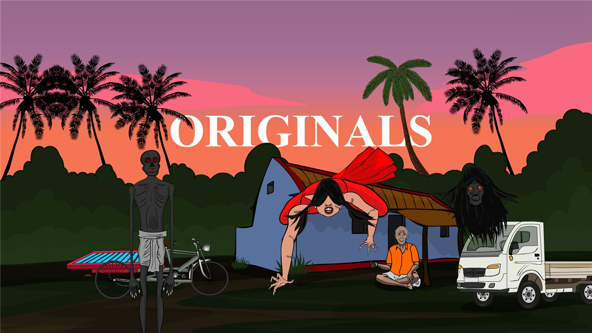

#  BuzzAnimate

GPU-accelerated vector animation. A from-scratch alternative to Adobe Animate,
targeting the three limits Animate inherited from 1996-era Flash:

| | Adobe Animate 2024 | BuzzAnimate |
|---|---|---|
| Maximum zoom | 2 000% | **no cap** — verified to 2×10¹⁴% |
| CPU usage | effectively single-threaded | **work-stealing pool across all cores** |
| Rasterisation | CPU | **GPU compute shaders (Vello)** |

Built clean-room. No decompilation of Adobe binaries and no reuse of Adobe
assets, icons, or trademarks. Formats read are published by Adobe (SWF,
AVM2/ABC), ISO standards (PDF), or plain XML (XFL).

---

## Status: Phases 0–5 and 7 complete

BuzzAnimate is now a working editor. It opens on an Animate-shaped window —
menu bar, tool strip, rulers around a white stage on a grey pasteboard, layers
and properties on the right, timeline along the bottom — and you can draw,
select, transform, edit anchor points, arrange, group, save, reopen and rely on
autosave.

Animate's **Merge Shape** model works as it should: overlapping fills of the
same colour fuse, a different colour cuts. Object Drawing is the alternative,
on the `J` toggle.

Since then: the **timeline** (keyframes and spans with Animate's F5/F6/F7
behaviour, playback on wall-clock time, onion skinning, an animated camera),
**symbols, a library and tweens**, **importers** for `.fla`/`.xfl`, `.swf` and
`.pdf`/`.ai`, fluid/pattern/art **brushes**, **layer depth** with camera
parallax, **scripting** through Animate's `fl` / `document` API, **rigging**
(armatures, FABRIK inverse kinematics with joint limits and pins, skinning and
puppet warp, poses that tween), **PNG export** of a frame or a range,
**masking**, **sound** — a soundtrack that stays audible inside nested
symbols, draws its waveform in the timeline, and drives automatic lip sync —
**lighting** — a sun, a sky or a lamp, dropped on the stage and aimed by
dragging it, with the artwork's colours, highlights and shadow direction all
following where it is put — **filters** (blur, drop shadow, glow, bevel, adjust
colour) and blend modes, and **layer parenting**, so a head layer follows a
body layer without a bone in sight. Every panel docks, floats, closes and
locks, and the arrangement is still there next time. The camera is **spatial**:
pitch and yaw it and the stage tips away in real perspective, a rectangle drawn
as a trapezoid — and **objects turn too**, so three flat cards at different
angles make a tree the camera discovers rather than slides past.

**Video comes out too**: MP4/MOV encoded on the GPU through NVENC, with the
soundtrack muxed in.

Not yet implemented, and honestly marked as such in the toolbar: Text, Bézier pen
authoring, multiple Scenes, clipboard. GIF/WebP and HTML5 export, AS3 and the Bind
tool are the largest gaps. See `PROGRESS.md` §7 for the full list.

---

## The engine, verified in Phase 0

Phase 0 exists to prove the three claims above before any authoring features are
built on top of them. All three are verified by automated tests against real
hardware, not asserted.

### Verified results

Measured on an i7-14700K (20C/28T) with an RTX 5060 Ti, via
`cargo test -p buzz-app --test headless_zoom --release -- --nocapture`:

```
 gen      zoom  precision    ink%  colours     encode       gpu  drawn/culled
   0  2e2%   3.64e-13   4.06%       48     0.21ms    10.8ms  43/181
   5  2e7%    3.64e-8   4.02%       47     0.10ms     0.8ms  70/154
  10  2e12%   3.64e-3   4.01%       54     0.10ms     0.9ms  70/154
  12  2e14%   3.64e-1   4.01%       54     0.08ms     0.8ms  72/152
```

Ink coverage is **constant at ~4% across thirteen decades of zoom** — rendering
quality is scale-invariant. Generation 0's 10.8 ms is one-off shader warmup; it
draws fewer items than generation 2, which takes 1.0 ms.

### The zoom mechanism

Animate's 2000% cap is a numeric limit, not a policy: Flash stores coordinates
as twips (1/20 px fixed point) and rasterises in `f32`. BuzzAnimate stores `f64`
and splits the view transform into three stages so nothing large ever reaches
the GPU:

```
1. CPU, f64:  q = p − anchor        well-conditioned; result is tiny
2. CPU, f64:  r = q × zoom          result is viewport-sized
3. GPU, f32:  s = rotate(r) + offset   unit scale; nothing large to lose
```

**Steps 1 and 2 must not be fused into one matrix.** A composed affine evaluates
`zoom·p − zoom·anchor`, which is the difference of two huge numbers and destroys
the answer. Both `buzz-geom` and `buzz-render` carry tests that fail if anyone
fuses them.

Applying the scale on the CPU (step 2) was not in the original design and was
added after measurement: leaving that multiply to the GPU cost **25 ms/frame at
1e12% zoom versus 0.9 ms**, and visibly degraded detail.

### Known precision limit

Rebasing removes catastrophic cancellation, but `f64` storage of an absolute
document coordinate leaves a floor:

```
precision_px ≈ |coordinate| × 2.22e-16 × zoom
```

For coordinates near 1e3 that is sub-pixel out to about **1e12%** — roughly ten
orders of magnitude past Animate — and degrades linearly rather than collapsing
after that. `Camera::screen_precision_px()` reports it live in the HUD.

---

## Running it

**Windows: double-click `BuzzAnimate.bat`.** It builds first when the sources
have changed — a no-op once the build is warm — and then starts the editor. A
launcher that quietly ran last week's binary would be a confusing thing to own.

```bat
BuzzAnimate.bat                        an empty document
BuzzAnimate.bat "C:\work\Scene.buzz"    open a document
BuzzAnimate.bat --gpu NVIDIA           choose a graphics adapter by name
BuzzAnimate.bat --script tidy.js       run a script at startup
BuzzAnimate.bat --dev                  the debug build: quicker to compile,
                                       slower to draw
```

`Create Desktop Shortcut.bat` puts a shortcut on the desktop. It points at the
launcher rather than at the binary, so it keeps working across a rebuild, a
`cargo clean`, and switching between the release and debug builds.

The console window that appears belongs to the editor: the adapter table is
printed there at startup, and so is the message telling you where your work was
written if the program ever crashes. Closing it closes the editor.

From a terminal, on any platform:

```sh
cargo run --release -p buzz-app
```

Moving around the stage, whatever tool is selected:

| Input | Action |
|---|---|
| Mouse wheel | Zoom about the cursor, unbounded |
| Space + drag | Pan |
| Middle-button drag | Pan |
| Zoom control, top right of the stage | Zoom out / in, a draggable percentage, presets, Fit in Window |

Flags: `--gpu <name-or-index>` forces an adapter, `--integrated` prefers iGPU.
The adapter table is printed at startup.

### Why adapter selection is real code

This machine enumerates seven adapters, including `Microsoft Basic Render
Driver` — a CPU rasteriser that would make "the GPU build" slower than Animate,
silently. Every adapter is scored and the table is logged:

```
   [0]   1110  NVIDIA GeForce RTX 5060 Ti     DiscreteGpu/Vulkan
   [1]    390  Intel(R) UHD Graphics 770      IntegratedGpu/Vulkan
-> [2]   1120  NVIDIA GeForce RTX 5060 Ti     DiscreteGpu/Dx12      <- selected
   [6]    n/a  Microsoft Basic Render Driver  Cpu/Dx12              <- disqualified
```

---

## Layout

| Crate | Role |
|---|---|
| `buzz-geom` | `f64` geometry: rebasing camera, perspective projection, clipping, booleans, hit-testing, path editing |
| `buzz-jobs` | Two-pool work-stealing job system; per-worker CPU metrics |
| `buzz-render` | GPU adapter selection; Vello scene building |
| `buzz-scene` | Copy-on-write document model; Animate's six layer types; R-tree index |
| `buzz-doc` | `.buzz` format, undo history, autosave |
| `buzz-ui` | Theme, menus, shortcut map, tool catalogue, panels, snapping |
| `buzz-app` | Window, frame loop, editor state, tool behaviour, stage rendering |
| `buzz-import-xfl` · `buzz-import-swf` · `buzz-import-pdf` | Readers for `.fla`/`.xfl`, `.swf` and `.pdf`/`.ai` |
| `buzz-script` | Sandboxed JavaScript over the document — Animate's JSFL API |
| `buzz-rig` | Armatures, FABRIK inverse kinematics, skinning, MLS warping |
| `buzz-export` | Rendering frames out: PNG images and sequences |
| `buzz-audio` | Decoding, waveforms, playback and lip-sync analysis |
| `buzz-light` | Suns, skies and lamps; shading, highlights and cast shadows as vector geometry |
| `buzz-fx` | Animate's filters — blur, drop shadow, glow, bevel, adjust colour — as vector geometry |

Remaining crates (`buzz-avm`, …) arrive with their phases; empty
placeholders would only be noise.

### Dependency pinning — read before upgrading

`vello 0.9` requires **wgpu ^29**, and `egui-wgpu 0.35` is the newest egui that
also uses wgpu 29. `egui 0.36` moved to wgpu 30.

Two majors of wgpu in one binary produce structurally distinct `Device` types
that cannot share a surface. **Do not bump egui past 0.35 until vello moves to
wgpu 30.** Verify with:

```sh
grep -A1 '^name = "wgpu"' Cargo.lock   # must list exactly one version
```

---

## Testing

```sh
cargo test --workspace            # 1 084 tests
cargo clippy --workspace --all-targets
cargo test -p buzz-app --test headless_zoom --release -- --nocapture
```

The headless zoom test drives the *same* encoding path the window uses, so what
is verified offscreen cannot drift from what is drawn. It skips cleanly when no
GPU is present.

---

## Roadmap

Done: engine foundation · geometry and document core · drawing tools and the
application shell · timeline · symbols, library and tweens · importers ·
rigging and IK · PNG export · the scripting API · lighting · filters and
blend modes · layer parenting · a workspace you arrange · a camera that
tilts · 3D rotation.

Next: **the engine waves** — background export with a queue, raster layers beside
the vectors, a compositor, 2.5D depth and keyframed lights. `ARCHITECTURE.md` is
the design; `IMPROVEMENTS.md` Part II is the summary. After those, the rest of
Phase 6 (GIF/WebP, HTML5 Canvas/SVG) and Phase 8's ActionScript runtime.

`ARCHITECTURE.md` is the forward design: how the engine waves are built, the rules
that keep the window responsive, and what each one costs.

`OVERVIEW.md` is the one-page consolidation: what is implemented, what the
restrictions are — hard limits, absences and deliberate deviations, kept apart
because the difference matters — and what is suggested next.

`PROGRESS.md` is the detailed record: what was built, what was measured, what
was found broken along the way, and every deviation from Animate with its
reason.

`IMPROVEMENTS.md` is the forward half of the same record: where the time
actually goes when an animator sets up a stage, read out of the source, and the
three waves of work that would close it.
