<p align="center">
  
</p>

# 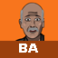 BuzzAnimate — Complete User Guide & Feature Reference Manual

> **Welcome to BuzzAnimate!** This comprehensive guide is designed for first-time animators and artists transitioning from Adobe Animate / Flash. Every tool, panel, menu command, shortcut, and workflow is documented, illustrated with snapshots, and cross-referenced in an exhaustive alphabetical index.

---

## 📑 Table of Contents & Quick Navigation

1. [Introduction & Architectural Highlights](#1-introduction--architectural-highlights)
2. [First-Time Setup & Launching the App](#2-first-time-setup--launching-the-app)
3. [Visual Tour of the Workspace](#3-visual-tour-of-the-workspace)
4. [Canvas Navigation & Unbounded Zoom](#4-canvas-navigation--unbounded-zoom)
5. [The Vector Drawing Engine: Merge Shapes vs. Object Drawing](#5-the-vector-drawing-engine-merge-shapes-vs-object-drawing)
6. [Comprehensive 23-Tool Catalogue](#6-comprehensive-23-tool-catalogue)
7. [Advanced Brushes, Patterns & Gradients](#7-advanced-brushes-patterns--gradients)
8. [Timeline Mastery & Frame-by-Frame Animation](#8-timeline-mastery--frame-by-frame-animation)
9. [The 7 Layer Kinds & Layer Hierarchy](#9-the-7-layer-kinds--layer-hierarchy)
10. [Tweens & The Motion Editor](#10-tweens--the-motion-editor)
11. [Symbols, Instances & The Library](#11-symbols-instances--the-library)
12. [Rigging, FABRIK Inverse Kinematics & Warping](#12-rigging-fabrik-inverse-kinematics--warping)
13. [Studio Vector Lighting & Shadow Engine](#13-studio-vector-lighting--shadow-engine)
14. [Vector Filters & Blend Modes](#14-vector-filters--blend-modes)
15. [Spatial 3D Camera & Layer Parallax](#15-spatial-3d-camera--layer-parallax)
16. [Soundtrack, Waveforms & Automated Lip Sync](#16-soundtrack-waveforms--automated-lip-sync)
17. [Production Staging, Directing & Motion That Runs Itself](#17-production-staging-directing--motion-that-runs-itself)
18. [Import & Export Pipelines](#18-import--export-pipelines)
19. [JavaScript Automation (JSFL API)](#19-javascript-automation-jsfl-api)
20. [Workspace Customization & Layouts](#20-workspace-customization--layouts)
21. [Complete Keyboard Shortcuts Reference](#21-complete-keyboard-shortcuts-reference)
22. [Troubleshooting & Pro Tips](#22-troubleshooting--pro-tips)
23. [Alphabetical Master Feature Index (A–Z)](#23-alphabetical-master-feature-index-az)

---

## 1. Introduction & Architectural Highlights

BuzzAnimate is a ground-up, GPU-accelerated vector animation suite built in Rust. It reconstructs the industry-standard workflow of Adobe Animate while overcoming decades-old limits inherited from 1996-era Flash.

```
┌───────────────────────────────────────────────────────────────────────────┐
│                          BUZZANIMATE ENGINE ARCHITECTURE                  │
├────────────────────────────────┬──────────────────────────────────────────┤
│ Feature                        │ Benefit for Animators                    │
├────────────────────────────────┼──────────────────────────────────────────┤
│ 🚀 Unbounded Zoom              │ Zoom into fine eyelashes or microscopic  │
│    (Verified to 2×10¹⁴%)       │ details without pixellation or caps.     │
├────────────────────────────────┼──────────────────────────────────────────┤
│ ⚡ Multi-Threaded Engine        │ Work-stealing thread pool utilizes all   │
│    (Interactive + Background)  │ CPU cores for instant responsiveness.    │
├────────────────────────────────┼──────────────────────────────────────────┤
│ 🎮 Compute-Shader Rendering    │ GPU rasterisation powered by Vello/wgpu. │
├────────────────────────────────┼──────────────────────────────────────────┤
│ 💡 Studio Vector Lighting       │ Suns, skies, lamps, gloom, and fires     │
│    & Cast Shadows              │ with real-time vector cast shadows.      │
├────────────────────────────────┼──────────────────────────────────────────┤
│ 🎥 Spatial 3D Camera           │ Pitch, yaw, and roll with genuine        │
│                                │ perspective projection & 2.5D parallax.  │
├────────────────────────────────┼──────────────────────────────────────────┤
│ 🦾 FABRIK Inverse Kinematics   │ Character skeletons, bone constraints,   │
│    & Pose Library              │ angle limits, and puppet warping.        │
├────────────────────────────────┼──────────────────────────────────────────┤
│ 👄 Automated Lip Sync          │ Audio waveform analysis into 10 visemes  │
│                                │ driving mouth symbol keyframes.          │
└────────────────────────────────┴──────────────────────────────────────────┘
```

---

## 2. First-Time Setup & Launching the App

### 2.1 Starting BuzzAnimate on Windows
- **Double-click `BuzzAnimate.bat`** in the application folder.
- The launcher verifies if changes have been made, compiles automatically if needed, and starts the application immediately.
- To create a permanent desktop icon, double-click **`Create Desktop Shortcut.bat`**.

```bat
:: Launcher Command-Line Options
BuzzAnimate.bat                        :: Opens a fresh, empty document
BuzzAnimate.bat "C:\Projects\Shot1.buzz" :: Opens an existing project
BuzzAnimate.bat --gpu NVIDIA           :: Forces a dedicated discrete GPU
BuzzAnimate.bat --integrated           :: Runs on power-efficient integrated GPU
BuzzAnimate.bat --script setup.js      :: Runs an automated startup script
BuzzAnimate.bat --dev                  :: Runs the debug build
```

### 2.2 Startup Console & GPU Adapter Table
When BuzzAnimate launches, a companion diagnostic console window opens. It scores every graphics adapter on your system and binds to the highest-performing hardware GPU:

```
   [0]   1110  NVIDIA GeForce RTX 5060 Ti     DiscreteGpu/Vulkan
   [1]    390  Intel(R) UHD Graphics 770      IntegratedGpu/Vulkan
-> [2]   1120  NVIDIA GeForce RTX 5060 Ti     DiscreteGpu/Dx12      <- selected
   [6]    n/a  Microsoft Basic Render Driver  Cpu/Dx12              <- disqualified
```
*(Closing the diagnostic console window will cleanly close the editor).*

---

## 3. Visual Tour of the Workspace

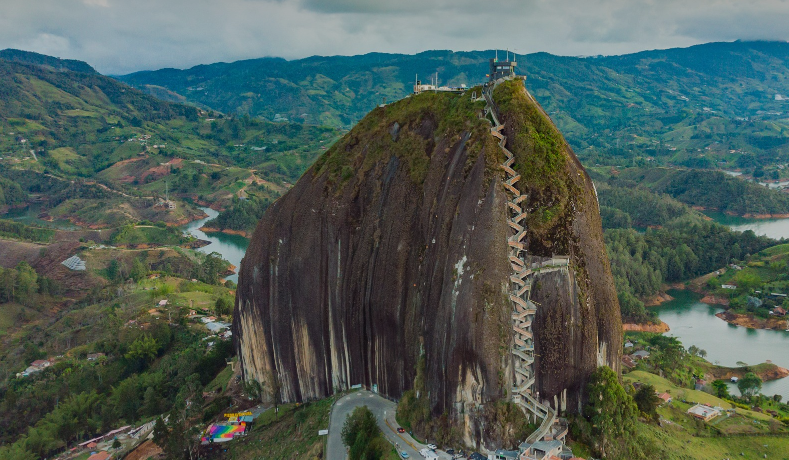

BuzzAnimate's user interface is partitioned into 6 functional zones:

```
┌─────────────────────────────────────────────────────────────────────────────────┐
│ 1. MENU BAR  (File, Edit, View, Insert, Modify, Control, Window, Help)           │
├───────┬────────────────────────────────────────────────────────┬────────────────┤
│ 2.    │ 3. STAGE & PASTEBOARD                                  │ 5. INSPECTOR & │
│ TOOL  │                                                        │    PROPERTIES  │
│ STRIP │  • White Stage: Exported camera boundaries             │  • Properties  │
│ (23   │  • Dark Grey Pasteboard: Offscreen drafting canvas     │  • Color       │
│ Tools)│  • Rulers, Snapping Guides & Light Gizmos              │  • Swatches    │
│       │  • Top-Right Stage Controls: Zoom presets & HUD        │  • Filters     │
├───────┴────────────────────────────────────────────────────────┤  • Lighting    │
│ 4. TIMELINE & PLAYBACK CONTROLS                                │  • Rigging     │
│  • Layers stack, Folders, Masks, Onion Skin, Looping section   │  • Sound / Lip │
│  • Frame ruler, Keyframes, Spans, Tweens, Audio Waveform       │  • Library     │
├────────────────────────────────────────────────────────────────┴────────────────┤
│ 6. DOCKABLE PANELS & BACKGROUND TASKS                                          │
└─────────────────────────────────────────────────────────────────────────────────┘
```

### Key UI Elements
1. **Menu Bar**: Complete file, editing, transformation, and document operations.
2. **Tool Strip**: Vertical toolbar grouped into selection, drawing, bone rigging, color, and navigation tools. Each button displays its single-letter keyboard shortcut.
3. **Stage & Pasteboard**: The active creative canvas. The white rectangle represents the printable/renderable frame. The surrounding dark gray pasteboard holds off-stage props, character turnarounds, and drafts.
4. **Timeline**: Frame sequencer displaying layers, keyframe spans, tweens, audio tracks, and onion skinning.
5. **Inspector / Property Docks**: Tabbed or stacked inspector panels for properties, swatches, layer depth, lighting, rigging, and sound.
6. **Task Bar & Notifications**: Real-time status for background video encoding, file imports, and auto-saves.

---

## 4. Canvas Navigation & Unbounded Zoom

BuzzAnimate eliminates the traditional 2,000% zoom ceiling found in older software. You can zoom to **2×10¹⁴%** without precision collapse or floating-point wobbles.

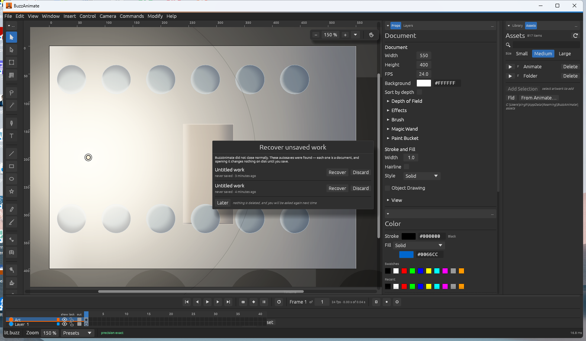

### Navigation Quick Controls
| Action | Input / Shortcut |
|---|---|
| **Pan Canvas** | `Spacebar + Drag` or `Middle-Click Drag` |
| **Smooth Zoom** | `Mouse Wheel Scroll` (centers directly under cursor) |
| **Step Zoom In** | `Ctrl + =` or `Z` tool click |
| **Step Zoom Out** | `Ctrl + -` or `Alt + Z` tool click |
| **100% Actual Size** | `Ctrl + 1` |
| **Show Frame (Stage)**| `Ctrl + 2` |
| **Fit in Window** | `Ctrl + 3` |
| **Show All Objects** | `Ctrl + Shift + W` |

> [!TIP]
> **Understanding the HUD**: Look at the top-right stage HUD overlay. It reports the active zoom generation (`gen`), ink coverage percentage, GPU draw time (`~0.9ms`), and screen precision down to sub-atomic scales.

---

## 5. The Vector Drawing Engine: Merge Shapes vs. Object Drawing

BuzzAnimate supports two distinct vector models. Understanding their interaction is essential for rapid drawing:

```
  MERGE SHAPE (Default)                 OBJECT DRAWING (Toggle 'J')
┌───────────────────────┐             ┌───────────────────────┐
│  Shape A    Shape B   │             │ ┌─────────┐           │
│   ┌────┐     ┌────┐   │             │ │ Shape A │ ┌─────────┤
│   │    ├─────┤    │   │             │ └─────────┤ │ Shape B │
│   └────┴─────┴────┘   │             │           └─┴─────────┘
│ Overlapping same-color│             │ Shapes remain independent │
│ shapes fuse. Different│             │ objects with bounding     │
│ colors cut each other!│             │ boxes and stacking order. │
└───────────────────────┘             └───────────────────────┘
```

### 1. Merge Shapes (Classic Flash Model)
- Shapes reside raw on the layer canvas.
- When two shapes of the **same color** touch, they seamlessly **fuse** into a single continuous polygon.
- When a shape of a **different color** is drawn over another, it **cuts away** the underlying geometry like a cookie cutter.
- **Carving with Lasso (`L`)**: Dragging the Lasso across a merge shape cuts the artwork along the drawn stroke!

### 2. Object Drawing Mode (Press `J` to toggle)
- Draws vector items inside protected containers with blue bounding boxes.
- Overlapping shapes do not merge or cut each other.
- Use **`Ctrl + B` (Break Apart)** to convert an Object Drawing back into Merge Shapes.

---

## 6. Comprehensive 23-Tool Catalogue

The toolbar is organized into logical functional blocks. The table below indexes every tool:

| Icon / Key | Tool Name | Shortcut | Group | Primary Purpose & Features |
|:---:|---|:---:|---|---|
| **V** | **Selection** | `V` | Select | Click to select fills or strokes. Double-click to select connected geometry. Drag fill edges to bend curves. |
| **A** | **Subselection** | `A` | Select | Direct vertex editing. Reveals cubic Bézier anchor points and tangent handles. |
| **L** | **Lasso** | `L` | Select | Freehand regional selection. Slices through merge artwork when dragged across it. |
| **G** | **Magic Wand** | `G` | Select | Click any color region to select all contiguous pixels/vectors within a set color tolerance. |
| **Q** | **Free Transform**| `Q` | Transform | Rotate, scale, skew, and reposition the pivot/origin point of objects, groups, and symbols. |
| **◑** | **Gradient Transform**| *(Menu)* | Transform | Move, scale, rotate, and adjust focal radius of linear and radial gradient fills. |
| **P** | **Pen** | `P` | Draw | Click to lay down straight anchor points; click-and-drag to create smooth Bézier arcs. |
| **T** | **Text** | `T` | Draw | Typesetting and title tool *(planned font shaping engine)*. |
| **N** | **Line** | `N` | Draw | Draws clean straight vector lines. Hold `Shift` to constrain to 45° increments. |
| **R** | **Rectangle** | `R` | Shapes | Draws rectangles and squares (`Shift`). Adjust Corner Radius in Properties for rounded boxes. |
| **O** | **Oval** | `O` | Shapes | Draws ellipses and perfect circles (`Shift`). |
| **☆** | **PolyStar** | *(Menu)* | Shapes | Draws regular polygons or stars. Customize vertex count and star-point depth in Properties. |
| **Y** | **Pencil** | `Y` | Freehand | Freehand strokes with 3 modes: **Straighten** (cleans lines), **Smooth** (cleans curves), **Ink** (raw). |
| **B** | **Brush** | `B` | Freehand | Rich painting with 7 brush models: Fluid, Normal, Pattern, Art, Soft, Effect, and Wave. |
| **M** | **Bone** | `M` | Rigging | Builds kinematic skeletons across shapes and symbols. Sets up FABRIK inverse kinematics. |
| **W** | **Asset Warp** | `W` | Rigging | Drops puppet warp pins onto vector artwork or images using Moving Least Squares (MLS). |
| **J** | **Motion Path** | `J` | Rigging | Draws a freehand vector curve; selected symbols follow and orient along the curve. |
| **K** | **Paint Bucket**| `K` | Color | Fills enclosed vector regions. Includes gap detection (Don't Close, Close Small/Medium/Large). |
| **S** | **Ink Bottle** | `S` | Color | Applies or changes stroke color, weight, and style to the outlines of existing shapes. |
| **I** | **Eyedropper** | `I` | Color | Samples fill color, stroke color, or stroke style directly from the stage. |
| **E** | **Eraser** | `E` | Edit | Erases strokes and fills. Modes: Erase Normal, Erase Fills, Erase Lines, Erase Inside. |
| **C** | **Camera** | `C` | View | Controls the cinematic 3D camera: pan, zoom, roll, pitch, and yaw. |
| **H** | **Hand** | `H` | View | Pans across the stage without affecting camera position or selection. |
| **Z** | **Zoom** | `Z` | View | Click to zoom in; `Alt + Click` to zoom out. Drag a marquee to zoom to a specific area. |

---

## 7. Advanced Brushes, Patterns & Gradients

The Brush tool (`B`) includes 7 specialized brush models selectable in the Properties panel:

```
┌─────────────┬─────────────────────────────────────────────────────────────┐
│ Brush Kind  │ Description & Best Use Case                                 │
├─────────────┼─────────────────────────────────────────────────────────────┤
│ 1. Fluid    │ Dynamic velocity-sensitive stroke. Thins when drawn fast    │
│             │ and fattens when drawn slow. Perfect for calligraphy & inking│
├─────────────┼─────────────────────────────────────────────────────────────┤
│ 2. Normal   │ Uniform-width marker stroke with optional start/end taper.  │
├─────────────┼─────────────────────────────────────────────────────────────┤
│ 3. Pattern  │ Stamps vector patterns repeatedly along the drawn stroke.   │
│             │ Built-ins: Dot, Dash, Leaf, Star, Arrow, Diamond, Custom.   │
├─────────────┼─────────────────────────────────────────────────────────────┤
│ 4. Art      │ Takes a single vector master shape and stretches it over    │
│             │ the entire length of your stroke.                           │
├─────────────┼─────────────────────────────────────────────────────────────┤
│ 5. Soft     │ Raster airbrush engine that renders soft-edge glowing strokes│
│             │ directly beside vector artwork.                             │
├─────────────┼─────────────────────────────────────────────────────────────┤
│ 6. Effect   │ Procedural scenery brush: paints falling snow, clouds,      │
│             │ silhouettes, or decorative string lights in a single stroke.│
├─────────────┼─────────────────────────────────────────────────────────────┤
│ 7. Wave     │ Animated flowing brush for smoke, flowing water, and hair.  │
│             │ Automatically advances its wave phase across frames!        │
└─────────────┴─────────────────────────────────────────────────────────────┘
```

### The 15 Effect Brush Kinds (Brush ▸ Effect)

One drag lays down vector silhouettes, gradient glows and painted pixels together — the whole point of a mixed raster-and-vector layer. Pick the kind in the Tool Options panel:

| Kind | What one stroke paints | What the fill colour does |
|---|---|---|
| **Snow** | Drifting flakes scattered along the stroke | Flake colour |
| **Rain** | Slanted streaks of rain | Streak colour |
| **Stars** | A star field: dots and four-point sparkles | Star colour |
| **Fireflies** | Warm glowing points scattered along the stroke | The fill colour is the light |
| **Bokeh** | Soft out-of-focus discs of light | The fill colour is the light |
| **Clouds** | Soft cumulus along the stroke | Cloud colour |
| **Diffused Light** | A soft wash of added light — an airbrush of glow | The fill colour is the light |
| **Light Rays** | Beams fanning from the stroke's start toward its end | The fill colour is the light |
| **Moonlight** | A glowing moon placed where the stroke ends | The fill colour is the light |
| **String Lights** | Fairy lights hanging from the stroke | Bulbs cycle a festive palette; the wire is dark |
| **Lamps** | Street lamps standing on the stroke, pools of light below | The fill colour is the light |
| **Buildings** | A lit city skyline standing on the stroke | Silhouette in the fill colour; windows glow warm |
| **Pine Trees** | A treeline of pines standing on the stroke | Silhouette in the fill colour |
| **Leafy Trees** | Round-crowned trees standing on the stroke | Silhouette in the fill colour |
| **Grass** | Blades of grass growing up from the stroke | Silhouette in the fill colour |

> **Pair them with Live Motion (§17.5).** Paint a treeline, then give it **Sway**; paint cloud, then give it **Drift**. That is a background that moves for two settings and no keyframes.

### Re-weighting Outlines (`[` and `]`)

**`Modify ▸ Shape ▸ Thicken Lines` / `Thin Lines`**, or the bracket keys — the same gesture every paint program binds for brush size, aimed at a drawing that is already down.

- Touches **only the outline**. The path is untouched, the fill is untouched, and a shape with no stroke is left exactly as it was.
- **Multiplies rather than adds**, so one press means the same thing on a hairline and on a heavy outline — and a drawing keeps its internal weighting instead of having it flattened.
- A **hairline** has no width to scale, so thickening one makes it a real line first; thinning one leaves it alone.
- One press is **one undo step**, however many lines it moved.

**One press either way**, on a drawing with a heavy contour and fine interior lines:

| `[` Thinner | As drawn | `]` Thicker |
|---|---|---|
| 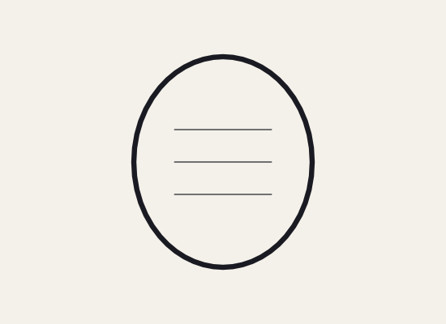 |  |  |

*The heavy contour and the fine lines keep their eight-to-one relationship through both presses. That is what the multiply is for: adding a fixed amount would have flattened the weighting the animator was looking at.*

> **Brush strokes are fills, not outlines.** A stroke painted with the Brush tool is a filled path in this program (that is the Flash drawing model), so the bracket keys will not touch it and will say so. Widening a *fill* is `Modify ▸ Shape ▸ Expand Fill`, which is a different operation with a different failure mode.

### Custom Pattern Brush from Selection
1. Draw any vector shape on the stage (e.g., a custom stitch, leaf, or emblem).
2. Select it using the Selection tool (`V`).
3. Choose **`Modify ▸ Create Brush From Selection`**.
4. Switch to the Brush Tool (`B`), select **Pattern**, and pick **From Selection**. Your drawing is now an active brush stamp!

### Gradients & Gradient Transform
- **Fills**: Open the **Color** panel to select **Linear Gradient** or **Radial Gradient**.
- Add, remove, and slide color stops along the gradient ramp.
- Activate the **Gradient Transform tool (`◑`)** on any gradient-filled shape:
  - Drag the **center circle** to reposition the focal hotspot.
  - Drag the **outer ring** to rotate the gradient angle.
  - Drag the **square handle** to stretch or squash the gradient width.

---

## 8. Timeline Mastery & Frame-by-Frame Animation

The timeline at the bottom of the window controls playback and animation timing:

```
Layer 3: Eyes       [●] [  F6  ][   F5   ][  F7  ][   F5   ]
Layer 2: Head       [●] [             F6                   ] (Classic Tween ──────>) [ F6 ]
Layer 1: Audio      [●] [~v~~V~~v~~~V~~v~~~V~~v~~~V~~~v~~~~] (Soundtrack: "Dialogue.wav")
                        |----|----|----|----|----|----|----|
Frame:                  1    5    10   15   20   25   30
```

### Frame Hotkeys & Fundamentals
- **Frame (`F5`)**: Extends the previous drawing across time without changing it.
- **Remove Frame (`Shift + F5`)**: Deletes the selected frame span, shortening playback duration.
- **Keyframe (`F6`)**: Creates a new keyframe that duplicates the previous drawing so you can alter it.
- **Blank Keyframe (`F7`)**: Creates a blank frame to begin a completely fresh drawing.
- **Clear Keyframe (`Shift + F6`)**: Removes a keyframe, turning the cell back into an extended span.
- **Clear Frames (`Alt + Backspace`)**: Empties contents of the frame while preserving span length.
- **Cut / Copy / Paste Frames**: `Ctrl + Alt + X` / `Ctrl + Alt + C` / `Ctrl + Alt + V`.

### Playback & Onion Skinning
- **Play / Pause**: Press `Enter` or the transport play button.
- **Step Forward / Backward**: Press `.` (period) to step forward one frame; `,` (comma) to step back.
- **First / Last Frame**: Press `Home` / `End`.
- **Onion Skinning (`Alt + Shift + O`)**: Displays ghosted silhouettes of preceding and succeeding frames. Drag the green and blue range markers in the frame ruler to broaden or narrow the preview window.
- **Edit Multiple Frames**: Select and transform shapes across dozens of keyframes simultaneously!
- **On Twos / On Threes (`Control ▸ On Twos` / `On Threes`)**: Holds every drawing for 2 (or 3) frames across the selected span — the traditional 12fps cadence inside a 24fps project, and half or a third of the drawings a shot needs.
- **Paint Through (`Control ▸ Paint Through`)**: **Ink and paint.** Carries this frame's bucket fills onto every keyframe after it, seeded from a point inside each region, flooded through the same gap-aware bucket you would have clicked with. Colouring is half the labour of drawn animation and almost none of the craft; this is the single largest saving in the program. Regions it could not match are reported rather than silently left blank.
- **Reverse Frames (`Control ▸ Reverse Frames`)**: Plays the layer's keyframes back to front.
- **Select Same Colour (`Edit ▸ Select Same Colour`)**: Everything on this frame painted the colour the selection is painted — recolour a whole character in one go.

---

## 9. The 7 Layer Kinds & Layer Hierarchy

BuzzAnimate supports 7 specialized layer types:

```
[+] Folder: Character
 ├── [Mask] Mask: Shadow_Cut
 ├── [Inverse Mask] InvMask: Hole_In_Wall  <-- BuzzAnimate Exclusive!
 ├── [Normal] Head
 ├── [Normal] Torso
 ├── [Guide] Sketch_Reference
 └── [Guided] Path_Follower
```

1. **Normal Layer**: Standard layer containing drawings, shapes, and symbol instances.
2. **Folder Layer**: Groups related layers together. Collapsible to organize complex scenes.
3. **Mask Layer**: Clips child layers indented beneath it. Only artwork falling *inside* the mask's shapes remains visible.
4. **Inverse Mask Layer** *(Exclusive to BuzzAnimate)*: Inverts standard masking — hides everything *inside* the mask shape while keeping everything *outside* visible! Essential for cutting dynamic holes, doorways, and silhouettes.
5. **Masked Layer**: A child layer governed by an active mask above it.
6. **Guide Layer**: Reference artwork layer (e.g. rough model sheets or rotoscope video). Displays faded on the stage and is **never exported** to the final render.
7. **Guided Layer**: A layer attached to a guide curve (e.g. for motion paths).

### Layer Parenting
- Drag a layer row and nest it under another layer to create a parent-child relationship (e.g., *Head* parented to *Neck*, parented to *Torso*).
- When the parent moves, rotates, or scales, the child follows automatically — **without requiring a skeletal bone rig**!

### Layer Depth & 2.5D Parallax
Open the **Layer Depth** panel (`Window ▸ Layer Depth`). It displays a side-view cross-section of your scene:
- Drag layers along the Z-axis to position them closer to or further from the camera.
- When the Camera pans or tilts, background layers automatically exhibit realistic parallax!

---

## 10. Tweens & The Motion Editor

BuzzAnimate offers three tween engines to automate in-between frames:

### 1. Classic Tween (`Insert ▸ Create Classic Tween`)
- Best for symbol instances.
- Place Symbol A on Keyframe 1, and the same Symbol A on Keyframe 20 in a new position/rotation. Right-click the span and choose **Create Classic Tween**. The timeline turns light purple with a connecting arrow.

### 2. Motion Tween (`Insert ▸ Create Motion Tween`)
- Object-based continuous tweening.
- Automatically records property changes (position, scale, rotation, color effect, filter intensity) at any frame without creating explicit keyframes.

### 3. Shape Tween (`Insert ▸ Create Shape Tween`)
- Organic vector morphing between Merge Shapes (e.g., a star morphing into a circle).
- Both start and end keyframes must contain raw, ungrouped vector shapes.

### The Motion Editor
Open `Window ▸ Motion Editor` to inspect the cubic Bézier acceleration curves of the active tween. Drag control handles to adjust ease-in, ease-out, bounce, and elastic timing.

---

## 11. Symbols, Instances & The Library

Symbols are reusable master assets stored inside the project **Library** (`Window ▸ Library`). Using symbols reduces file size and allows global asset updates across the entire production.

```
┌─────────────────────────────────────────────────────────────┐
│                      SYMBOL TYPES                           │
├───────────────┬─────────────────────────────────────────────┤
│ Graphic       │ Synced 1:1 with the main timeline.          │
│               │ Scrubbable on the stage; ideal for lip-sync,│
│               │ walk cycles, and character expressions.     │
├───────────────┼─────────────────────────────────────────────┤
│ MovieClip     │ Self-contained timeline that loops          │
│               │ independently of the parent scene.          │
├───────────────┼─────────────────────────────────────────────┤
│ Button        │ Interactive 4-frame asset:                  │
│               │ [Up] [Over] [Down] [Hit]                    │
└───────────────┴─────────────────────────────────────────────┘
```

### Creating and Editing Symbols
- **Convert Selection to Symbol**: Select shapes on the stage and press **`F8`**. Give it a name and choose the symbol type.
- **Create Empty Symbol**: Press **`Ctrl + F8`**.
- **Edit in Place**: Double-click any symbol instance on the stage or press **`Ctrl + E`**. The rest of the scene dims, allowing you to edit the symbol's internal timeline.
- **Return to Main Document**: Double-click empty canvas space or press **`Ctrl + F4`**.

### The Library Panel & Vector Thumbnails
- Every symbol in the Library displays a **live-rendered vector thumbnail**.
- Organize symbols into folders.
- **Swap Symbol (`Modify ▸ Swap Symbol`)**: Replace an instance on the stage with a different library symbol while preserving position, scale, and tweens.

---

## 12. Rigging, FABRIK Inverse Kinematics & Warping

BuzzAnimate includes a built-in character rigging and deformation suite (`Window ▸ Rigging`).

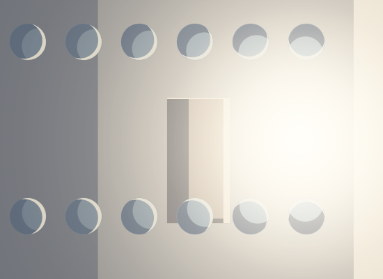

### Skeletons with the Bone Tool (`M`)
1. Place character limbs on consecutive layers or convert them to symbols.
2. Select the **Bone Tool (`M`)**.
3. Drag from the pelvis to the chest, shoulder to elbow, and elbow to wrist to build a kinematic chain.
4. **FABRIK IK Solver**: Grab the hand or foot and drag. The entire limb flexes and reaches naturally!
5. **Joint Limits & Pins**: In the Rigging panel, set rotation constraints (e.g. elbow limited to 0°–145°) and pin foot bones to prevent floor sliding.

### The Pose Library
- Click **Save Pose** in the Rigging panel to save character stances (e.g., "Idle", "Contact", "Recoil", "Jump").
- **Mirror Pose**: Instantly flips left and right limbs for effortless symmetric walk and run cycles.
- **Pose-to-Pose Keying**: BuzzAnimate automatically interpolates between stored library poses across the timeline!

### Asset Warp (`W`)
- Select the Asset Warp tool and click directly on vector drawings or imported bitmaps to drop mesh deformation pins.
- Drag pins to bend and squash artwork organically via Moving Least Squares (MLS) mathematics.

---

## 13. Studio Vector Lighting & Shadow Engine

BuzzAnimate features a specialized studio vector lighting system (`Window ▸ Lighting`). Lights are real-time vector mathematical primitives that calculate surface shading, highlights, and cast shadow polygons.

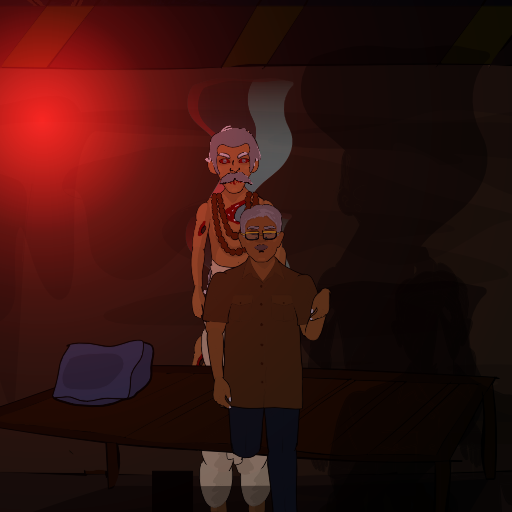
*(Above: A stage illuminated by vector lighting vs unlit flat artwork)*

### 5 Specialized Light Types
```
┌───────────┬─────────────────────────────────────────────────────────────────┐
│ Light     │ Characteristics & Behavior                                      │
├───────────┼─────────────────────────────────────────────────────────────────┤
│ 1. Sun    │ Directional sunlight across the entire stage. Aimed via an      │
│           │ intuitive interactive 360° celestial dial.                      │
├───────────┼─────────────────────────────────────────────────────────────────┤
│ 2. Sky    │ Hemispherical ambient fill illumination with no hard shadows.   │
├───────────┼─────────────────────────────────────────────────────────────────┤
│ 3. Lamp   │ Point light with adjustable origin, radius, color, and smooth   │
│           │ quadratic falloff.                                              │
├───────────┼─────────────────────────────────────────────────────────────────┤
│ 4. Gloom  │ Negative light / shadow wall that subtracts illumination.       │
│           │ Throws theatrical darkness into back corners.                   │
├───────────┼─────────────────────────────────────────────────────────────────┤
│ 5. Fire   │ Dynamic guttering hearth light. Fluctuates warm orange-yellow   │
│           │ intensity and shadow length automatically across frames!        │
└───────────┴─────────────────────────────────────────────────────────────────┘
```

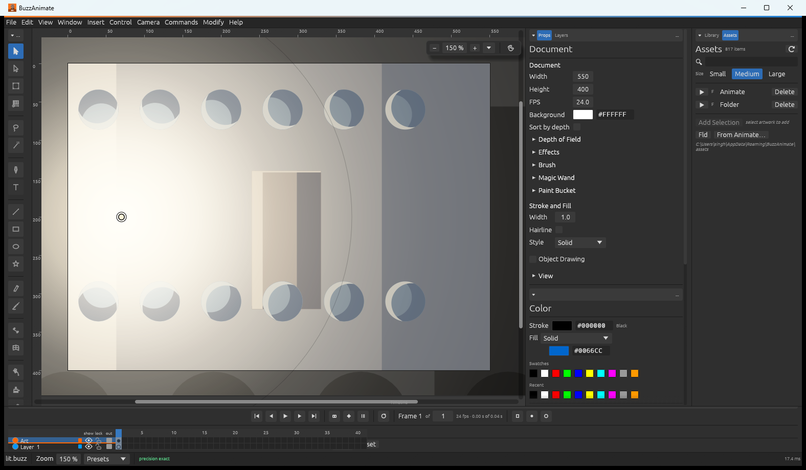

### Working with Light Gizmos
- Press **`Ctrl + Shift + L`** to show/hide stage light gizmos.
- Drag a lamp's central handle to move it. Drag the outer radius ring to adjust falloff range.
- **Cast Shadows**: Check *Cast Shadows* on any lamp or sun. Shadow polygons are computed directly against vector artwork contours:

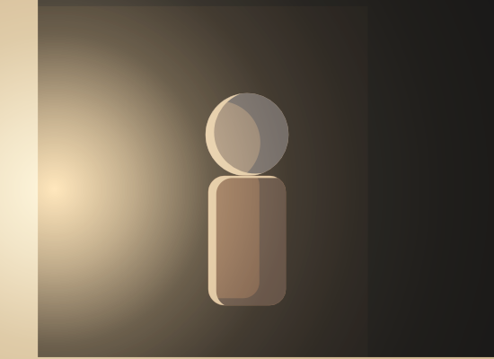

- **Keyframed Lighting**: Click **Add Light Keyframe** in the Lighting panel to animate light position, color, and intensity along the timeline (e.g., a flashlight sweeping across a room or a flickering torch).

---

## 14. Vector Filters & Blend Modes

Select an object or an entire layer and open the **Filters** panel (`Window ▸ Filters`):

```
┌─────────────────┬─────────────────────────────────────────────────────────┐
│ Vector Filter   │ Adjustable Parameters                                   │
├─────────────────┼─────────────────────────────────────────────────────────┤
│ Blur            │ X Radius, Y Radius, Quality (Low, Medium, High).        │
├─────────────────┼─────────────────────────────────────────────────────────┤
│ Drop Shadow     │ Distance, Angle, Shadow Color, Blur, Strength, Knockout,│
│                 │ Inner Shadow, Hide Object.                              │
├─────────────────┼─────────────────────────────────────────────────────────┤
│ Glow            │ Blur, Strength, Color, Inner Glow, Knockout.            │
├─────────────────┼─────────────────────────────────────────────────────────┤
│ Bevel           │ Distance, Angle, Highlight Color, Shadow Color, Blur,   │
│                 │ Strength, Bevel Type (Inner, Outer, Full).              │
├─────────────────┼─────────────────────────────────────────────────────────┤
│ Adjust Color    │ Brightness, Contrast, Saturation, Hue Rotation (-180°..+180°).│
└─────────────────┴─────────────────────────────────────────────────────────┘
```

### 10 Blend Modes
Choose blend modes on any symbol or layer:
- **Normal**, **Layer**, **Darken**, **Multiply**, **Lighten**, **Screen**, **Overlay**, **Hard Light**, **Add**, and **Difference**.

---

## 15. Spatial 3D Camera & Layer Parallax

Select the **Camera tool (`C`)** to activate the cinematic stage camera.

```
       [Camera Viewport]
            /      \
           /  Roll  \      <-- Pitch & Yaw rotate the stage into 3D!
          /          \
  ┌──────┴────────────┴──────┐
  │  Stage in 3D Perspective │  <-- Objects turn as flat cards in depth!
  └──────────────────────────┘
```

### Camera Controls
- **Pan & Zoom**: Click and drag on the stage with the Camera tool to pan. Use the stage zoom slider or scroll wheel to zoom the lens.
- **Roll (Rotate)**: Drag the rotation wheel in the camera stage chrome to tilt the camera.
- **Pitch & Yaw (Spatial 3D)**: Rotate the stage in genuine 3D perspective. The camera renders the stage trapezoidally, and vector cards rotate in depth.
- **Camera Keyframing**: The timeline includes a dedicated **Camera Track**. Insert keyframes (`F6`) on the camera track to execute sweeping cinematic dollies, tracking shots, and dramatic zooms.
- **Easing**: every camera key carries an ease governing the move that *leaves* it — the same curve model the artwork tweens use. It matters more here than anywhere else: the camera is the audience's head, and a head does not start at full speed and stop dead. A linear pan is the single most reliable tell that a shot was assembled rather than filmed.

### Named Camera Moves (`Camera ▸ Move`)

A push in is two keyframes and a number. So is a pan, and so is a reveal — and an animator making a story a week keys the same four of them hundreds of times. None of it is a decision; all of it is typing. Pick one and it is written from the playhead to the end of the scene, **already eased**:

| Move | What it writes |
|---|---|
| **Push In** | Closes in on the middle of frame |
| **Pull Out** | Gives the shot its air back |
| **Pan Left / Right** | Tracks a quarter of the stage sideways, magnification unchanged |
| **Reveal** | Opens close and pulls back to the framing you set up — the one move defined by where it *ends*, so the opening key is the derived one |
| **Drift** | A slow diagonal creep under the whole shot: what a documentary does to a photograph, and the cheapest way to stop a held drawing reading as a still |

```
Camera ▾
 ├ ✔ Camera
 ├ ────────────────
 ├ Add Camera Keyframe
 ├ Remove Camera Keyframe
 ├ Reset Camera
 ├ ────────────────
 ├ Move  ▸ ┌──────────────┐
 │         │ Push In      │
 │         │ Pull Out     │
 │         │ Pan Left     │
 │         │ Pan Right    │
 │         │ Reveal       │
 │         │ Drift        │
 └ 2 keyframes └──────────┘
```

1. Put the playhead where the move should **start**.
2. **Camera ▸ Move ▸** pick one.
3. It is written to the end of the scene and the camera is switched on for you. Drag the second key in to shorten it.

**What each one does to the framing** — all six from the same opening wide:

| Opening frame | Push In | Pull Out |
|---|---|---|
| 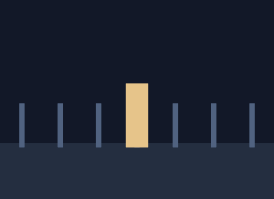 | 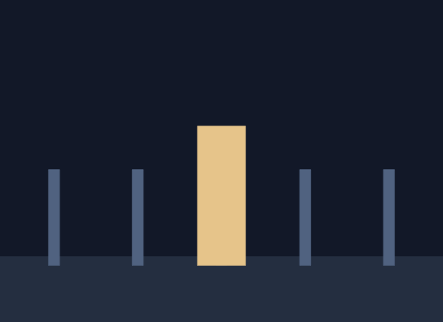 | 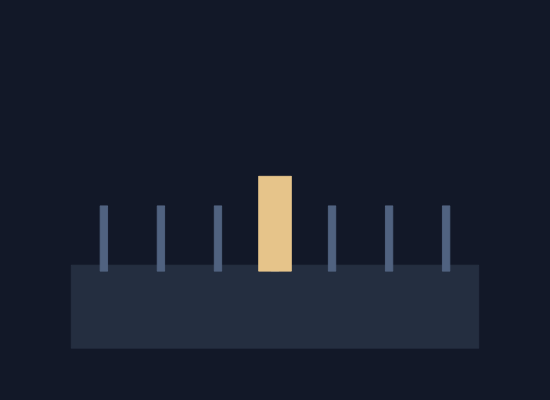 |

| Pan Left | Pan Right | Drift |
|---|---|---|
| 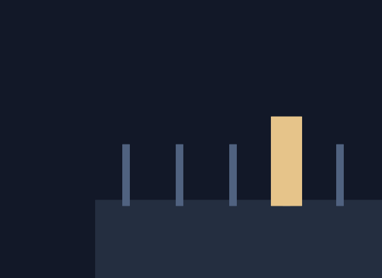 | 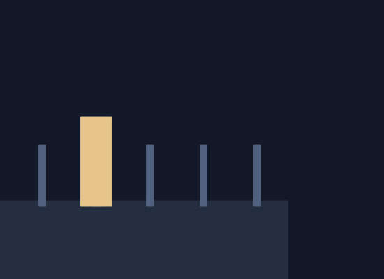 | 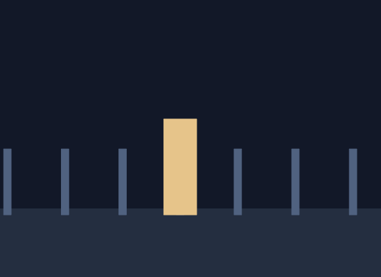 |

**Reveal** is the odd one out, shown here by its *opening* frame — it is the only move defined by where it ends, so the close framing is the derived key and the wide is the one you set up:


**And what the easing is for** — the same pan, a fifth of the way in:

| Linear | Eased |
|---|---|
| 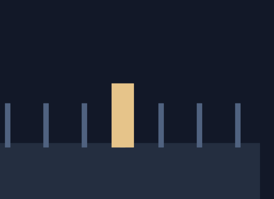 |  |

*A fifth of the way through an identical move. The linear camera is already at full speed and will stop dead at the other end; the eased one is still getting under way. This is the difference between a shot that was filmed and one that was assembled.*

Each move starts from **the framing already in force**, so pushing in twice pushes in twice, and turning the camera on is part of the command.

What comes out is **two ordinary camera keys**. Shortening the move is dragging the second one; nothing is live and nothing re-runs.

> **Why the drift is not eased.** Every other move slows away and slows into place. A drift is meant to run underneath a shot without being seen, and easing one gives it a beginning and an end — which is exactly the thing the audience would then notice. It is left linear on purpose.

> **Why a move runs to the end of the scene** rather than for a fixed two seconds: because that is what a camera move in a shot nearly always does. A push, a drift and a reveal are the length of the shot they are in — they are not events inside it.

---

## 16. Soundtrack, Waveforms & Automated Lip Sync

BuzzAnimate features an integrated audio playback and phonetic lip-sync analysis engine.

### Importing Audio
- Select **`File ▸ Import ▸ Import Sound…`** or press **`Ctrl + R`**.
- Supported audio formats: **`.wav`, `.mp3`, `.ogg`, `.flac`, `.m4a`, `.aac`**.
- The soundtrack renders its full audio waveform directly on the timeline layer.
- **Detect Musical Beats**: Choose **`Control ▸ Detect Beats`** to mark rhythmic percussion beats with vertical ticks on the frame ruler.

### Captions In and Out (`File ▸ Import/Export Captions (.srt)`)

An **SRT** is the subtitle format — plain text, and about as simple as a format gets:

```
1
00:00:01,000 --> 00:00:04,200
Ana: We should go before it gets dark.

2
00:00:05,100 --> 00:00:07,800
Ben said nothing.
```

A number, a timecode pair, the line, a blank line. Every transcription tool writes it, and so does YouTube — which means **you never have to type any of it**.

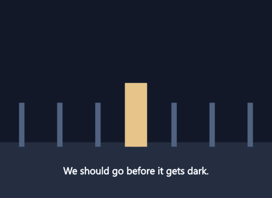

**Import is the direction that matters.** The program can already hear *where* a narration speaks (Fit to Narration, above) and not a word of *what* it says. A subtitle file is the one place both sit together, so importing one gives the document something it has never had: the words, on the frame they are spoken.

1. Transcribe your voice-over with whatever you like — Whisper, Descript, or YouTube's own auto-caption download.
2. **`File ▸ Import Captions (.srt)…`**
3. You get a **Captions layer**, each line keyed to its own timecode, centred near the bottom of the stage, and gone again when the line ends.

**Export** writes the **active layer's** text back out. That rule is deliberate: a title card is text and a logo is text, and neither is a caption — the only thing that separates them is which layer you put them on. The import leaves its own layer selected, so a round trip needs no thought.

**What it forgives**, because real subtitle files are written by a hundred programs and plenty are careless:

| | |
|---|---|
| A **byte-order mark** | Windows tools add one, and it lands right on the first cue |
| **`,` or `.`** before the milliseconds | SRT says comma, WebVTT says stop, tools emit both |
| **No index lines** | Plenty of files have none |
| **Numbers out of order** | Cues are sorted by their timecodes, not by what they claim |
| **Markup** — `<i>`, `<font …>`, `{\an8}` | Stripped: the text becomes *artwork*, and a literal `<i>` drawn on the picture is worse than a line that is not italic |
| **One mangled block** | Skipped and counted, not fatal. The status line says how many |

A file with *nothing* readable in it is refused outright — that means the wrong file was picked, and an empty layer would send you looking in the wrong place.

**Who says what.** A line like `Ana: We should go.` names a speaker, and the status line lists the cast it found. But `Meanwhile: the door opened.` is exactly as name-shaped and is not a character — so the decision is made across the **whole file**, not line by line: a prefix counts as a speaker if it **comes back on another line**, or is written in **capitals** (`ANA:`, the broadcast convention). Anything else is left in the text, because the safe direction to be wrong in is keeping a word you can delete rather than silently deleting one and casting somebody called Meanwhile.

> **What this unlocks next.** Knowing who speaks and when is the missing half of routing a line to a character's mouth and running lip sync on that actor automatically — see `docs/AUTOMATION.md`.

---

### Lip Sync from Captions (`File ▸ Lip Sync from Captions`)

Lip sync on its own drives **one mouth against the whole soundtrack** — run it on Ana and she mouths Ben's lines too. Fine for a monologue, useless for a conversation, which is most of what a story is.

What was missing was never the analysis. It was knowing **who is speaking and when** — and an imported subtitle file says exactly that. So:

1. **Import the dialogue** (`File ▸ Import Sound…`).
2. **Import captions that name the speakers** — `Ana: We should go.` (§ above).
3. Give each character a **mouth symbol named after them**: `Ana`, or `Ana Mouth`, or `Ana_mouth`. At least 10 frames, one per shape — `File ▸ New Mouth Symbol` makes one to draw over.
4. With the caption layer selected, **`File ▸ Lip Sync from Captions`**.

Each character gets mouth keyframes **over their own lines and nobody else's**, on a layer of their own name (made if there is not one).

| The rule | Why |
|---|---|
| A speaker is matched to a symbol **by name**, exactly or as a word inside it | A dialog with a row per speaker is the same work as doing it by hand once there are more than about three of them |
| Word-bounded, so `Ana` does not match `Anabel` | A substring match would have Ana driving Anabel's mouth, and you would spend an hour looking for the reason |
| The closest name wins | So `Ana` beats `Ana and Ben` when both exist |
| A speaker with **no matching symbol is named** in the status line | The fix is to rename the symbol, and the message can say so outright |
| **The mouth closes at the end of every line** | Otherwise the last shape holds until that character speaks again, leaving them frozen mid-vowel through everybody else's dialogue |
| An existing mouth's **placement is kept** | Running it twice does not drag the mouth back to the middle of the stage |

**Who is speaking is stored on the caption keyframe's label** — a frame label, Animate's own idea. That means it is **visible in the timeline and editable by hand**: if the import got somebody wrong, retype the label and run this again. A name buried where you could not see it would have made a mis-detected speaker unfixable.

> The whole track is analysed **once** and then sliced per line. Analysing each line separately would re-window the audio at every cue boundary and give a different answer at the seams than a single pass does.

---

### Fitting the Timeline to a Narration (`File ▸ Fit to Narration`)

A narrated film is timed by audio that already exists and cannot move. Every shot length and every cut is fitted to it — and fitting them by dragging keyframes against a waveform by eye is the single largest block of time in a week of that work. The soundtrack already says where the lines are.

1. Import the narration (`File ▸ Import Sound…`).
2. Select the layer you are going to draw on.
3. **`File ▸ Fit to Narration`**.

You come back to a timeline that is **the right length**, with a **blank keyframe at the start of every line**, and the lines **marked on the ruler**. Then you draw.

**How it hears the lines.** Not with the beat detector — that looks for *attacks*, which is where a drum is, and a narration run through it comes back as a beat per plosive. What matters in a voice-over is the opposite thing: the **silences**, because that is where the sentences end. So it thresholds rather than differentiates:

| Behaviour | Why |
|---|---|
| The threshold is a **fraction of the track's own speaking level** | A narration recorded ten decibels down is still a narration; a fixed threshold would hear nothing in it |
| The reference is the **75th percentile**, not the peak | One door slam would otherwise set the level for the whole take and deafen it to the actual voice |
| Gaps shorter than **a quarter second** do not break a line | Every stop consonant is a short silence; breaking on those would give you a keyframe per syllable |
| Anything shorter than **0.2s** is not a line | That is a cough, a click, or the microphone being knocked |

**Run it again after a re-record.** A keyframe is only inserted where the layer does not already have one, so re-running adds the lines that moved and leaves everything you drew against the lines that did not.

> **Why keyframes and not a scene per line.** A scene per line would be tidier to look at and wrong to work with: the soundtrack is cued on one scene, so cutting the film into thirty of them would leave twenty-nine with no audio under them. The narration stays whole; the timeline is divided instead.

---

### Automated Lip Sync in 3 Steps
1. Choose **`File ▸ New Mouth Symbol`**. BuzzAnimate creates a Graphic Symbol pre-populated with 10 labeled viseme mouth shapes:

```
Frame 0: Rest   (Closed/Relaxed)    Frame 5: L     (Tongue up)
Frame 1: Ai     (Open vowel)        Frame 6: WQ    (Pursed/tight)
Frame 2: E      (Wide vowel)        Frame 7: MBP   (Lips pressed)
Frame 3: O      (Round open)        Frame 8: FV    (Teeth on lip)
Frame 4: U      (Pursed vowel)      Frame 9: Etc   (Consonants: D,T,S,K)
```

2. Select **`File ▸ Lip Sync…`** (`Window ▸ Lip Sync`).
3. Select your dialogue audio track, choose the mouth symbol, and pick the destination character layer. Click **Confirm**.
4. BuzzAnimate analyzes the audio frequencies and automatically assigns corresponding mouth keyframes across the timeline!

---

## 17. Production Staging, Directing & Motion That Runs Itself

The **`buzz-act`** subsystem does the parts of a shot that are *arithmetic rather than drawing*: arranging a set, standing a cast in it, walking them about, and keeping everything alive between the keys. It lives under **`Insert ▸ Scene`**, and every one of these commands leaves behind **ordinary layers, shapes, keyframes and poses** — one `Ctrl + Z` takes any of it back, and the first thing you are meant to do with the result is change it.

> **In depth:** [`SCENES_AND_THE_DIRECTOR.md`](SCENES_AND_THE_DIRECTOR.md) explains the arithmetic behind each of these — the framing rules, the breath curve, the wind bias — and is the reference to read when a result surprises you.

### 17.1 Set the Scene (`Insert ▸ Scene ▸ Set the Scene…`)

Builds a staged environment: ground plane, backdrop, a light rig that agrees with itself, and a cast standing on the floor at plausible sizes and distances. **Five settings**, each a complete rig rather than a colour swap:

| Setting | The rig it builds |
|---|---|
| **Daylight** | A high sun, a blue ambient sky, short hard-edged shadows |
| **Sunset** | A low sun near the horizon, a warm sky, shadows running long |
| **Night** | A dark sky, a cold ambient fill, and one warm practical lamp doing the work |
| **Interior** | No sky at all — a wall, a floor, and a practical luminaire |
| **Storm** | A near-black sky that **strikes**: the stage goes white for a few frames every few seconds, for ever, with no keyframes anywhere. Colder fill, and it arrives with cloud |

Each member of the staged cast is handed a live **Breathe** (§17.5) as it is placed, so a set scene is alive the moment it appears rather than a row of held drawings.

- **Add Person (`Insert ▸ Scene ▸ Add Person`)** puts one more rigged figure on the stage, on a layer of its own.
- **Add Scene / Duplicate Scene (`Insert ▸ Scene ▸ …`)** start the next shot of the film, or a complete copy of this one — which is what the next beat of a conversation starts from.

### 17.2 Direct a Story (`Insert ▸ Scene ▸ Direct a Story…`)

A few lines of ordinary prose in; a staged, cast, blocked and framed shot out.

```
Night. Ana walks in from the left.
Ana talks to Ben. Ben listens.
Ben walks off right.
```

**What it does with that:**
1. **Reads the setting** from the slug line and sets the scene (§17.1), including cloud and water if the prose mentions a sky or a river.
2. **Casts** every capitalised word it has no other explanation for, in order of first appearance.
3. **Schedules the beats.** Sentences run in story order; each actor has a clock, and a sentence starts when everyone in it is free. **"Meanwhile"** starts a sentence alongside the previous one instead. An explicit *"for three seconds"* is honoured.
4. **Writes the performance** as ordinary pose keyframes — walking on and off from either wing, walking toward another actor and stopping at conversational distance, walking across, running, talking, waiting.
5. **Frames the shot.** The camera opens wide, **cuts** to whoever is speaking (close, centred, the zoom worked out from that actor's own height so a head is never cropped) and **pans** with anybody walking. An idle holds whatever framing it inherited.
6. **Keeps everyone alive.** Somebody spoken *to* listens rather than freezing, and everyone left standing when their part ends idles quietly to the end of the shot.

**Multiple shots.** A blank line, or a new slug line, cuts the brief into shots — and a whole brief becomes **one scene per shot**, each named from its own first words. A shot that does not restate the time of day stays in the one before it.

**It fails loudly, not cleverly.** There is no language model here: the parser is a keyword grammar over the setting words, a few dozen verbs, the direction words and the names. Every sentence it could not read is listed back to you verbatim, because a director who silently skips a line of the script is worse than one who asks.

### 17.3 Animate the Selection (`Insert ▸ Scene ▸ Perform…`)

Four actions, written onto the timeline as poses on the selected rig:

| Action | What is written | Cycle |
|---|---|---|
| **Walk** | Legs and arms in opposition, the body rising and falling twice a stride, travelling forward | ~1.0 s |
| **Run** | A longer stride, a deeper body drop, arms bent and driving | ~0.6 s |
| **Talk** | A weight shift, head movement on the stresses, hands coming up — and deliberately **no mouth** | ~3.2 s |
| **Idle** | Standing and breathing: the difference between a held drawing and a dead one | ~4.0 s |

**The mouth is never touched.** Lip sync is a fact about the soundtrack (§16); a performance is a choice about the body. They run independently on the same character, which is what lets you re-record the dialogue without re-animating the gestures.

**Retarget Performance (`Insert ▸ Scene ▸ Retarget Performance`)** copies one rig's poses onto another with the same skeleton — one walk drives a whole cast.

### 17.4 Turnarounds (`Insert ▸ Scene ▸ …`)

Give a drawing the other views of itself, and it turns as it moves instead of sliding about facing forward.

- **Set Reverse Drawing** — the second selected object becomes the first's back view.
- **Add Profile Right / Left** — the drawing shown at a quarter turn.
- **Add Three-Quarter Right / Left** — the view part way between front and profile, which is where most acting happens.
- **Clear Reverse Drawing** — removes the whole turnaround.

### 17.5 Live Motion — the modifiers (**Filters panel ▸ Live Motion ▸ +**)

Rules evaluated **when a frame is drawn**, not baked into keys. Seven of them:

| Modifier | What it does | Reach for it when |
|---|---|---|
| **Breathe** | The chest rises and falls about the drawing's own feet | Any character on a held pose |
| **Blink** | The lid falls and lifts every few seconds | The eye artwork on any character |
| **Turn** | Carries a face's features round a cylinder so it turns | A grouped head, without drawing another view |
| **Sway** | The drawing bends downwind from its base, in gusts | Trees, grass, banners, hanging signs |
| **Drift** | A steady move that loops | Clouds, water, a street behind a window |
| **Wiggle** | A deterministic wander | Idle sway, a breeze, a handheld camera shake |
| **Spring** | Damped follow-through on a bone chain | Hair, tails, coats |
| **Look At** | Turns the object to face a point on the stage | Eyes and heads that track |
| **Squash & Stretch** | Stretches along the direction of motion and squashes across, preserving volume | Selling weight and speed |

Look At, Squash & Stretch, Breathe, Blink, Turn, Sway and Drift are added from the **Filters** panel; **Spring** and **Wiggle** come from `Insert ▸ Scene ▸ Add Follow-Through…` and `Add Wiggle…`, which can *also* bake instead of running live.

**Breathe** deserves its own note, because it is the one everybody needs and nobody thinks of. A held pose in animation is never *still* — a drawing that does not move between two keys reads as a picture of a character rather than as a character standing there. Breathe fixes it with about **two per cent of scale**, anchored at the bottom of the drawing so the feet stay planted and the motion goes into the chest.

- **Rate** is in breaths per minute — **14 at rest**, 30 and up after running.
- **Depth** scales it; `1.0` is a comfortable resting breath.
- The curve is **not a sine** (a breath fills quickly and empties slowly; a pure sine reads as a machine), and the phase is **seeded from the object**, so a crowd does not breathe in unison — which is the one thing that would make it visible.

**Blink** is the other half of the same job, and on a face it is the larger half. An audience does not consciously see a blink either — but a character who holds a stare for eight seconds while talking is unnerving in a way nobody can name, and that is exactly the trap a puppet built for limited animation falls into, because its eyes are one drawing that nothing ever touches.

- Put it on the **eye artwork**, not on the whole character. Like Sway on a tree, the lid falls on whatever drawing you give it; on a whole figure the whole figure ducks.
- **Rate** is in blinks per minute — **12 is at rest**, and much past 20 starts to read as nerves, which is a choice rather than a default.
- **Duration** is how long one blink takes. `0.16s` is a real one, and four frames at 24fps — which is also what an animator would draw.
- The lid **falls faster than it lifts**, the bottom edge is held so the eye closes downward the way a real lid does (pinching it shut about the middle reads as a wince), the interval is **jittered** so the eye is not a ticking clock, and roughly one blink in six comes as a **double**. Like the breath, the phase is seeded from the object, so a cast never blinks in unison.

**How to put one on** — the Filters panel, with the eye artwork selected:

```
┌─ Filters ───────────────────────────────┐
│  Blend  [ Normal        ▾]              │
│ ─────────────────────────────────────── │
│  Live Motion  1                    [ + ]│   ← the + opens the list
│                                    ├──────────────────┐
│  ✕ Blink  [bpm 12.0] [s 0.16]      │ Look At          │
│                                    │ Squash & Stretch │
│                                    │ Breathe          │
│                                    │ Blink        ◀── │
│                                    │ Sway             │
│                                    │ Drift            │
└────────────────────────────────────└──────────────────┘
```

1. Select the eyes. **Group them first** (`Ctrl + G`) — see the warning below.
2. **Filters ▸ Live Motion ▸ + ▸ Blink**.
3. Leave it at 12 bpm. Play the shot; you should not be able to catch it.

| Open | Shut |
|---|---|
|  | 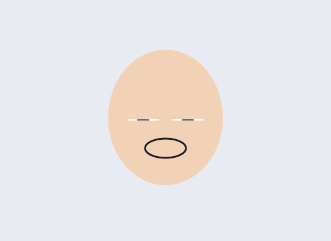 |

*The same character four frames apart. The lid falls to the bottom edge of the eye rather than pinching it shut about the middle, which is what a real lid does — and why the closed frame reads as a blink rather than as a wince.*

> ⚠️ **Group both eyes into one object before adding the modifier.** The phase is seeded from the *object*, which is what stops a whole cast blinking in unison — and it means two eyes left as two separate objects will blink **independently**. A character who winks at random is a worse problem than one who never blinks. One modifier, on the thing that closes together.

### Turning a Face Without Drawing Another One

A drawing has no information about its own sides. Rotate a flat card in space and you get a *card* turning — the face foreshortens evenly to nothing and looks like a photograph on a swivel, because that is exactly what it is.

**Turn** does what every 2D puppet on television has done for forty years: it does not rotate the drawing, it moves what is on it. A head is roughly a cylinder, so a feature some distance from the centre line sits at a known angle around it. Turn the cylinder and every feature's new position falls out — the near ones sweep across quickly, the far ones crowd toward the edge and go round the back, and each narrows by exactly the foreshortening its own angle earns. Nothing is invented and no drawing is asked for that does not exist.

**Five angles off one drawing**, nothing drawn twice:

| ← Turned left | Three-quarter | Front | Three-quarter | Turned right → |
|---|---|---|---|---|
| 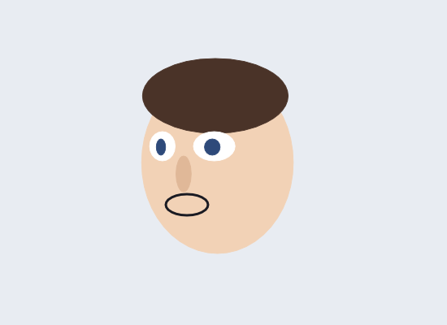 | 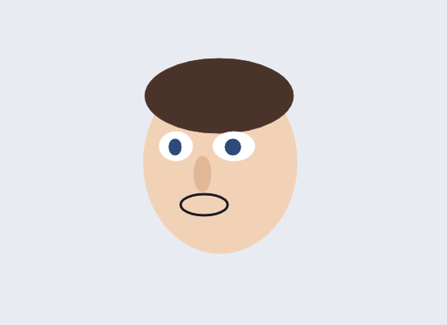 | 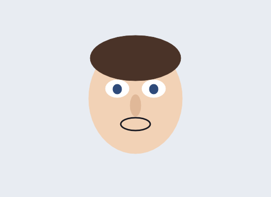 | 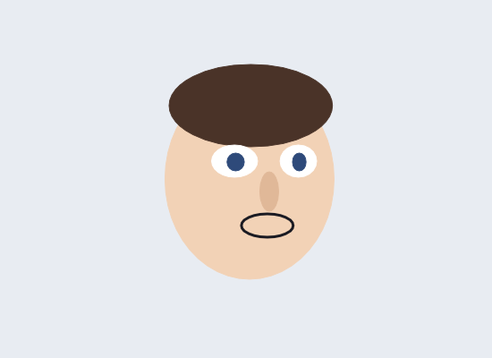 | 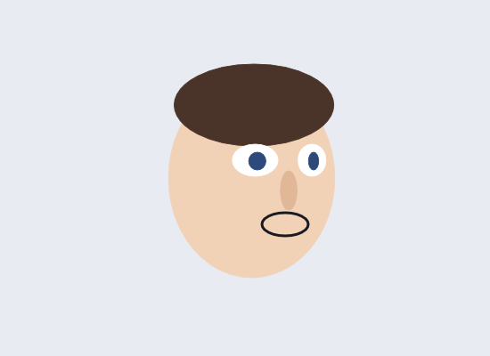 |

*Only the middle picture was drawn. Watch the far eye: it narrows and crowds toward the silhouette, which is what a real one does and what a rotated card cannot.*

**How to set one up:**

1. **Group the head** (`Ctrl + G`) with the parts in painting order — the head shape first, then hair, eyes, nose, mouth on top of it. **The backmost child is taken as the head form; everything painted over it is a feature.** That is the order a face is drawn in anyway, so there is nothing to name and no slots to fill.
2. **Filters ▸ Live Motion ▸ + ▸ Turn.**
3. **Key the head's 3D yaw** the way you would key anything — the angle comes from the object's own `rotationY`, not from a setting on the modifier, so the tween interpolates it and the head turns *through* the move instead of popping between poses.

| Setting | What it means |
|---|---|
| **round** | How much of a cylinder the drawing is. `1.0` for a head; lower for something flatter; `0` for a signboard that should only slide, never foreshorten |

**Three things it gets right that are easy to get wrong:**

- **Wide parts are masses, not marks.** Hair, a hat, a beard — anything spanning most of the head — moves with the *form* rather than sweeping like a nose. Move hair like a feature and it slides off the skull and bares the forehead. (The figure above is what caught that.)
- **A feature that goes round the back is dropped**, not squashed onto the silhouette. Features piling up on the edge is the single most obvious way a puppet turn gives itself away.
- **A drawn view always wins.** If the character carries a turnaround (§17.4) whose view is nearer to the current angle than the front is, Turn stands aside and lets that drawing be used. A profile somebody drew beats any arithmetic. What this covers is the angles *between* the drawings — which, on a puppet with none, is all of them.

> **A face drawn as one shape** still turns — the outline itself is warped — but only so far. Separate the features into a group when that is not far enough.

**Why live rather than baked:**
- **Re-time the animation and it re-follows.** Nothing to re-bake.
- **Cost does not grow with the length of the film.** One setting per object, whether the shot is two seconds or two minutes.
- **Same maths as the bakers.** The live spring and wiggle are the *same* solvers Add Follow-Through and Add Wiggle use — "live" and "bake to keyframes" are two deliveries of one calculation.

### 17.6 Baking

- **Add Follow-Through (`Insert ▸ Scene ▸ Add Follow-Through…`)** — bakes a damped-spring response of a chosen bone chain (hair, a tail) to the rig's keyed motion.
- **Add Wiggle (`Insert ▸ Scene ▸ Add Wiggle…`)** — bakes deterministic organic jitter onto the selected object: handheld camera shake, a wind gust, an idle sway.
- **Bake Modifiers (`Insert ▸ Scene ▸ Bake Modifiers`)** — evaluates the selection's live modifiers across the whole film into keyframes and then removes them. Live becomes editable.
- **Clear Modifiers (`Insert ▸ Scene ▸ Clear Modifiers`)** — removes every live modifier from the selection.

---

## 18. Import & Export Pipelines

### Tracing a Picture into Artwork (`Modify ▸ Bitmap`)

Pixels are the one thing in this program you cannot bucket-fill, reshape, tween or recolour. **Trace Bitmap** turns an imported picture into ordinary shapes — paths with fills, on a layer, exactly like something drawn with the brush.

| Command | What it is for |
|---|---|
| **Trace Bitmap** | A photo or a flat illustration. Six colours, the background kept |
| **Trace as Line Art** | A scan of a drawing. Ink and paper, **the paper thrown away**, so what is left is outlines you can paint inside |

1. Select the imported picture.
2. **`Modify ▸ Bitmap ▸ Trace as Line Art`** (or **Trace Bitmap** for colour).
3. The picture is **replaced** by the artwork it became. Bucket-fill inside the outlines as you would any drawing.

| The picture | Traced as line art | Traced in colour |
|---|---|---|
| 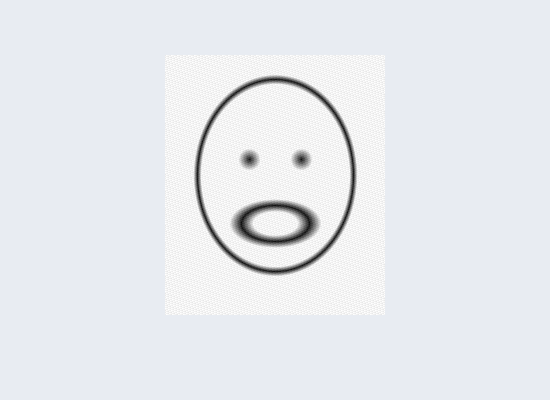 | 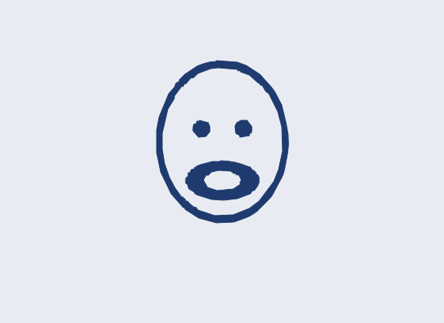 | 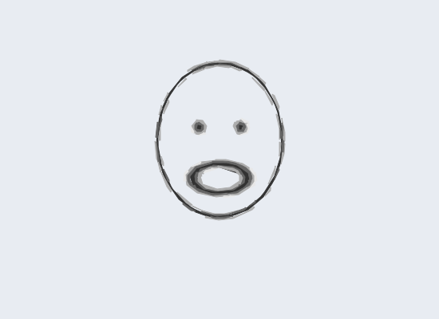 |

*A deliberately grainy, anti-aliased raster on the left — a clean synthetic shape would prove nothing about a real scan. The middle is what came out, recoloured blue so it is visibly **shapes** rather than a picture of the original: closed outlines, the mouth's hole intact, the paper gone.*

**What it does and does not do:**

- It finds **areas** and outlines them; it does not follow a pencil stroke and hand you a stroked path down its middle. A traced line comes back as a long thin filled shape — which is exactly what a brush stroke already is here, so it behaves like one.
- **Holes stay holes.** A traced ring is a ring, not a disc.
- **Specks are dropped.** A quantised photograph produces thousands of one-pixel islands along every edge; they are dither, not artwork, and left in they make a document nothing can open quickly. The status line says how many went.
- **Transparency is not traced**, so a cut-out arrives as a cut-out rather than a rectangle with the shape knocked out of it.
- **The picture is replaced, and one `Ctrl + Z` puts it back.** Leaving the photograph underneath would mean aiming every later selection and fill past it.
- **The same picture traces the same way every time**, so re-tracing after nudging a setting does not reshuffle the result.

---

### 18.1 File Import Support
- **Adobe Animate Projects**: Reads uncompressed `.xfl` and modern `.fla` archives.
- **Adobe Flash SWF**: Extracts vector shapes, morphs, and symbol definitions from `.swf`.
- **Adobe Illustrator & Vector PDF**: Reads vector graphics, paths, and gradients from `.ai` and `.pdf`.
- **Raster Images & Sequences**: Imports PNG, JPEG, and numbered animation folders.
- **Video Reference Layer**: Imports MP4/MOV footage onto a Guide Layer for rotoscoping.

### 18.2 Export Formats & Background Render Queue
Open the Export dialog via **`File ▸ Export`**:

```
┌───────────────────────────────────────────────────────────────────────────┐
│                             EXPORT OPTIONS                                │
├───────────────────┬───────────────────────────────────────────────────────┤
│ Image (PNG)       │ Exports the current frame as high-res PNG (32-bit     │
│                   │ transparent RGBA or white background).               │
├───────────────────┼───────────────────────────────────────────────────────┤
│ PNG Sequence      │ Exports numbered image sequence (`frame_0001.png`...).│
├───────────────────┼───────────────────────────────────────────────────────┤
│ Video (MP4 / MOV) │ Hardware-accelerated GPU encoding via NVENC           │
│                   │ (`h264_nvenc`, `hevc_nvenc`, `av1_nvenc`) with        │
│                   │ software fallback. Muxes soundtrack automatically!    │
├───────────────────┼───────────────────────────────────────────────────────┤
│ ProRes 4444 (.mov)│ Broadcast-quality video preserving full 8-bit alpha   │
│                   │ transparency for downstream video compositing.        │
├───────────────────┼───────────────────────────────────────────────────────┤
│ Animated GIF/WebP │ Highly-optimized web animations with palette dithering│
│                   │ and transparency.                                     │
├───────────────────┼───────────────────────────────────────────────────────┤
│ Animate .fla      │ Exports project back out to Adobe Animate format.     │
└───────────────────┴───────────────────────────────────────────────────────┘
```

> [!NOTE]
> **Non-Blocking Background Tasks**: All video and sequence exports run on asynchronous background threads. Open the **Tasks panel (`Window ▸ Tasks`)** to monitor progress bars, cancel jobs, or queue multiple exports while continuing to animate without interruption.

---

## 19. JavaScript Automation (JSFL API)

BuzzAnimate includes a sandboxed ECMAScript engine that supports Adobe Animate's `fl` / `document` scripting API. Open the **Actions Panel (`F9`)**:

```javascript
// Example: Generate an animated grid of shapes
var doc = fl.getDocumentDOM();
var timeline = doc.getTimeline();

fl.trace("Automating layout on document: " + doc.name);

// Create a new layer
timeline.addNewLayer("Generated_Art");

// Draw 10 circles across the stage
for (var i = 0; i < 10; i++) {
    doc.addNewOval({
        left: 50 + (i * 45),
        top: 200,
        right: 90 + (i * 45),
        bottom: 240
    });
}

fl.trace("Created 10 vector circles successfully!");
```

- Press **`Ctrl + Enter`** inside the Actions panel to execute scripts.
- Use `fl.trace(message)` to print feedback to the Script Output area.

---

## 20. Workspace Customization & Layouts

### Docking, Floating & Tabs
- Every panel (Layers, Properties, Swatches, Rigging, Lighting, Depth, Library) can be docked to the Left, Right, Bottom, or torn off as an independent Floating Window.
- Combine panels into tabbed sections to conserve screen space.
- **Lock Layout (`Ctrl + Alt + L`)**: Freezes all panel borders and docks to prevent accidental dragging during intense drawing sessions.
- **Reset Workspace (`Window ▸ Reset Layout`)**: Restores all panels to default factory docking.
- **Command Palette (`Ctrl + K`)**: Press `Ctrl + K` to summon an instant spotlight search bar. Type any command or tool name and hit `Enter` to run it immediately.
- **Interface Theme**: Switch between **Studio Dark** and **Paper Light** in `Window ▸ Light Interface`.

---

## 21. Complete Keyboard Shortcuts Reference

### Tool Shortcuts
| Key | Tool | Key | Tool |
|:---:|---|:---:|---|
| **`V`** | Selection | **`Y`** | Pencil |
| **`A`** | Subselection | **`B`** | Brush |
| **`L`** | Lasso | **`M`** | Bone (Rigging) |
| **`G`** | Magic Wand | **`W`** | Asset Warp |
| **`Q`** | Free Transform | **`J`** | Motion Path / Toggle Object Drawing |
| **`P`** | Pen | **`K`** | Paint Bucket |
| **`T`** | Text | **`S`** | Ink Bottle |
| **`N`** | Line | **`I`** | Eyedropper |
| **`R`** | Rectangle | **`E`** | Eraser |
| **`O`** | Oval | **`C`** | Camera |
| **`H`** | Hand (Pan) | **`Z`** | Zoom |

### Timeline & Animation Shortcuts
| Shortcut | Command |
|---|---|
| **`F5`** | Insert Frame (extend span) |
| **`Shift + F5`** | Remove Frame |
| **`F6`** | Insert Keyframe |
| **`Shift + F6`** | Clear Keyframe |
| **`F7`** | Insert Blank Keyframe |
| **`Alt + Backspace`** | Clear Frames (empty span) |
| **`Ctrl + Alt + X`** | Cut Frames |
| **`Ctrl + Alt + C`** | Copy Frames |
| **`Ctrl + Alt + V`** | Paste Frames |
| **`Enter`** | Play / Pause Timeline |
| **`.` (Period)** | Step 1 Frame Forward |
| **`,` (Comma)** | Step 1 Frame Backward |
| **`Home` / `End`** | Go to First / Last Frame |
| **`Alt + Shift + O`** | Toggle Onion Skinning |

### Selection, Editing & Symbol Shortcuts
| Shortcut | Command |
|---|---|
| **`Ctrl + Z`** | Undo |
| **`Ctrl + Shift + Z` / `Ctrl + Y`** | Redo |
| **`Ctrl + X` / `Ctrl + C` / `Ctrl + V`** | Cut / Copy / Paste |
| **`Ctrl + D`** | Duplicate Selection |
| **`Ctrl + A`** | Select All |
| **`Ctrl + Shift + A`** | Deselect All |
| **`Ctrl + G`** | Group Selection |
| **`Ctrl + Shift + G`** | Ungroup Selection |
| **`Ctrl + B`** | Break Apart (symbols, groups, object drawing) |
| **`F8`** | Convert Selection to Symbol |
| **`Ctrl + F8`** | Create New Empty Symbol |
| **`Ctrl + E`** | Edit Symbol in Place |
| **`Ctrl + F4`** | Exit Symbol Editing (Return to Document) |
| **`Arrow Keys`** | Nudge Selection by 1 unit |
| **`Shift + Arrow Keys`** | Nudge Selection by 8 units |

### Stage, View & Workspace Shortcuts
| Shortcut | Command |
|---|---|
| **`Ctrl + K`** | Open Command Palette (Search any action) |
| **`Ctrl + 1`** | Zoom 100% (Actual Size) |
| **`Ctrl + 2`** | Show Frame (Fit stage boundaries) |
| **`Ctrl + 3`** | Fit in Window |
| **`Ctrl + Shift + W`** | Show All Objects |
| **`Ctrl + Alt + Shift + R`** | Toggle Rulers |
| **`Ctrl + '`** | Toggle Grid |
| **`Ctrl + ;`** | Toggle Snapping Guides |
| **`Ctrl + Shift + U`** | Toggle Object Snapping |
| **`Ctrl + Shift + L`** | Toggle Stage Light Gizmos |
| **`Ctrl + Alt + L`** | Lock / Unlock Workspace Layout |
| **`F9`** | Toggle Actions (JavaScript Scripting) Panel |

---

## 22. Troubleshooting & Pro Tips

### 1. Vector Drawing Not Merging?
- Check if **Object Drawing** is enabled. Press **`J`** to toggle back to Merge Shape mode, or select your drawing and press **`Ctrl + B` (Break Apart)**.

### 2. Bucket Tool Not Filling a Gap?
- If lines don't meet precisely, the paint bucket may refuse to fill. In the tool properties, set **Gap Detection** to **Close Medium Gaps** or **Close Large Gaps**.

### 3. GPU Performance & Shaders
- BuzzAnimate uses modern GPU compute pipelines. Ensure your graphics drivers are updated. On multi-GPU laptops, ensure the application is bound to the high-performance discrete GPU via `BuzzAnimate.bat --gpu NVIDIA`.

### 4. Automatic Crash Recovery
- BuzzAnimate writes incremental snapshots of your document in the background. If an unexpected power outage occurs, reopening the editor will detect recovery files and prompt you to restore your document with zero data loss.

---

## 23. Alphabetical Master Feature Index (A–Z)

### A
- [Actions Panel (`F9`)](#19-javascript-automation-jsfl-api)
- [Adjust Color Filter](#14-vector-filters--blend-modes)
- [Align & Distribute](#20-workspace-customization--layouts)
- [Animation on Twos / Threes](#8-timeline-mastery--frame-by-frame-animation)
- [Armatures & Skeletons](#12-rigging-fabrik-inverse-kinematics--warping)
- [Art Brush](#7-advanced-brushes-patterns--gradients)
- [Asset Warp Tool (`W`)](#12-rigging-fabrik-inverse-kinematics--warping)
- [Audio Formats (.wav, .mp3, .ogg, .flac)](#16-soundtrack-waveforms--automated-lip-sync)
- [Automated Lip Sync](#16-soundtrack-waveforms--automated-lip-sync)
- [Autosave & Crash Recovery](#22-troubleshooting--pro-tips)

### B
- [Bake Modifiers](#17-production-staging-directing--motion-that-runs-itself)
- [Breathe (Live Motion)](#17-production-staging-directing--motion-that-runs-itself)
- [Beat Detection](#16-soundtrack-waveforms--automated-lip-sync)
- [Bevel Filter](#14-vector-filters--blend-modes)
- [Blank Keyframes (`F7`)](#8-timeline-mastery--frame-by-frame-animation)
- [Blend Modes (Multiply, Screen, Add...)](#14-vector-filters--blend-modes)
- [Blink (Live Motion)](#17-production-staging-directing--motion-that-runs-itself)
- [Blur Filter](#14-vector-filters--blend-modes)
- [Bitmap Tracing](#18-import--export-pipelines)
- [Captions (SRT Import / Export)](#16-soundtrack-waveforms--automated-lip-sync)
- [Bone Tool (`M`)](#12-rigging-fabrik-inverse-kinematics--warping)
- [Break Apart (`Ctrl + B`)](#5-the-vector-drawing-engine-merge-shapes-vs-object-drawing)
- [Brush Tool (`B`) & Types](#7-advanced-brushes-patterns--gradients)
- [Button Symbols](#11-symbols-instances--the-library)

### C
- [Camera 3D Perspective](#15-spatial-3d-camera--layer-parallax)
- [Camera Moves (Push In, Reveal, Drift)](#15-spatial-3d-camera--layer-parallax)
- [Camera Tool (`C`)](#15-spatial-3d-camera--layer-parallax)
- [Cast Shadows (Vector Calculations)](#13-studio-vector-lighting--shadow-engine)
- [Classic Tweens](#10-tweens--the-motion-editor)
- [Command Palette (`Ctrl + K`)](#20-workspace-customization--layouts)
- [Convert to Symbol (`F8`)](#11-symbols-instances--the-library)
- [Custom Pattern Brushes](#7-advanced-brushes-patterns--gradients)

### D
- [Daylight Staging](#17-production-staging-directing--motion-that-runs-itself)
- [Direct a Story](#17-production-staging-directing--motion-that-runs-itself)
- [Drift (Live Motion)](#17-production-staging-directing--motion-that-runs-itself)
- [Dialogue Routed to a Character](#16-soundtrack-waveforms--automated-lip-sync)
- [Dockable Panels](#20-workspace-customization--layouts)
- [Drop Shadow Filter](#14-vector-filters--blend-modes)

### E
- [Edit in Place (`Ctrl + E`)](#11-symbols-instances--the-library)
- [Edit Multiple Frames](#8-timeline-mastery--frame-by-frame-animation)
- [Effect (Scenery) Brush](#7-advanced-brushes-patterns--gradients)
- [Effect Brush — the 15 Kinds](#7-advanced-brushes-patterns--gradients)
- [Easing on Camera Keys](#15-spatial-3d-camera--layer-parallax)
- [Eraser Tool (`E`)](#6-comprehensive-23-tool-catalogue)
- [Export Captions (.srt)](#16-soundtrack-waveforms--automated-lip-sync)
- [Export Formats (PNG, MP4, GIF, WebP, ProRes)](#18-import--export-pipelines)
- [Eyedropper Tool (`I`)](#6-comprehensive-23-tool-catalogue)

### F
- [FABRIK Inverse Kinematics](#12-rigging-fabrik-inverse-kinematics--warping)
- [Filters Panel](#14-vector-filters--blend-modes)
- [Fire Light](#13-studio-vector-lighting--shadow-engine)
- [Face Turning Without Redrawing](#17-production-staging-directing--motion-that-runs-itself)
- [Fit to Narration](#16-soundtrack-waveforms--automated-lip-sync)
- [Fluid Brush](#7-advanced-brushes-patterns--gradients)
- [Folder Layers](#9-the-7-layer-kinds--layer-hierarchy)
- [Follow-Through Physics](#17-production-staging-directing--motion-that-runs-itself)
- [Free Transform Tool (`Q`)](#6-comprehensive-23-tool-catalogue)

### G
- [Gap Detection (Paint Bucket)](#6-comprehensive-23-tool-catalogue)
- [Gloom (Negative Light)](#13-studio-vector-lighting--shadow-engine)
- [Glow Filter](#14-vector-filters--blend-modes)
- [Gradient Transform Tool (`◑`)](#7-advanced-brushes-patterns--gradients)
- [Graphic Symbols](#11-symbols-instances--the-library)
- [Guide Layers (Rotoscoping)](#9-the-7-layer-kinds--layer-hierarchy)

### H
- [Head Turn (Live Motion)](#17-production-staging-directing--motion-that-runs-itself)
- [Hand Tool (`H`) / Spacebar Pan](#4-canvas-navigation--unbounded-zoom)
- [HUD Telemetry Display](#4-canvas-navigation--unbounded-zoom)

### I
- [Importing .fla, .xfl, .swf, .pdf, .ai](#18-import--export-pipelines)
- [Ink & Paint (Paint Through)](#8-timeline-mastery--frame-by-frame-animation)
- [Import Captions](#16-soundtrack-waveforms--automated-lip-sync)
- [Ink Bottle Tool (`S`)](#6-comprehensive-23-tool-catalogue)
- [Inverse Mask Layers (Exclusive)](#9-the-7-layer-kinds--layer-hierarchy)

### J
- [JavaScript Automation (JSFL API)](#19-javascript-automation-jsfl-api)
- [Joint Constraints & Pinning](#12-rigging-fabrik-inverse-kinematics--warping)

### K
- [Keyframes (`F6`)](#8-timeline-mastery--frame-by-frame-animation)
- [Keyframed Lights](#13-studio-vector-lighting--shadow-engine)

### L
- [Lamp (Point Light)](#13-studio-vector-lighting--shadow-engine)
- [Lasso Tool (`L`)](#6-comprehensive-23-tool-catalogue)
- [Layer Depth (2.5D Parallax)](#9-the-7-layer-kinds--layer-hierarchy)
- [Layer Parenting](#9-the-7-layer-kinds--layer-hierarchy)
- [Line Art Tracing](#18-import--export-pipelines)
- [Library & Live Thumbnails](#11-symbols-instances--the-library)
- [Light Gizmos (`Ctrl + Shift + L`)](#13-studio-vector-lighting--shadow-engine)
- [Line Tool (`N`)](#6-comprehensive-23-tool-catalogue)
- [Lip Sync Dialog & Visemes](#16-soundtrack-waveforms--automated-lip-sync)
- [Live Motion Modifiers](#17-production-staging-directing--motion-that-runs-itself)
- [Look At (Live Motion)](#17-production-staging-directing--motion-that-runs-itself)
- [Line Weight (`[` and `]`)](#7-advanced-brushes-patterns--gradients)
- [Lip Sync from Captions](#16-soundtrack-waveforms--automated-lip-sync)
- [Looping Timeline Sections](#8-timeline-mastery--frame-by-frame-animation)

### M
- [Magic Wand Tool (`G`)](#6-comprehensive-23-tool-catalogue)
- [Mask Layers](#9-the-7-layer-kinds--layer-hierarchy)
- [Merge Shape Mode](#5-the-vector-drawing-engine-merge-shapes-vs-object-drawing)
- [Mirror Poses](#12-rigging-fabrik-inverse-kinematics--warping)
- [Motion Editor & Easing](#10-tweens--the-motion-editor)
- [Motion Path Tool (`J`)](#10-tweens--the-motion-editor)
- [Motion Tweens](#10-tweens--the-motion-editor)
- [Multi-Character Lip Sync](#16-soundtrack-waveforms--automated-lip-sync)
- [Mouth Symbols (10 Visemes)](#16-soundtrack-waveforms--automated-lip-sync)
- [MovieClip Symbols](#11-symbols-instances--the-library)

### N
- [Normal Brush](#7-advanced-brushes-patterns--gradients)
- [Normal Layers](#9-the-7-layer-kinds--layer-hierarchy)
- [Narration-Driven Timing](#16-soundtrack-waveforms--automated-lip-sync)
- [Nudge Selection (`Arrow Keys`)](#21-complete-keyboard-shortcuts-reference)
- [NVENC GPU Video Encoding](#18-import--export-pipelines)

### O
- [Object Drawing Mode (`J`)](#5-the-vector-drawing-engine-merge-shapes-vs-object-drawing)
- [Onion Skinning (`Alt + Shift + O`)](#8-timeline-mastery--frame-by-frame-animation)
- [Oval Tool (`O`)](#6-comprehensive-23-tool-catalogue)

### P
- [Paint Bucket Tool (`K`)](#6-comprehensive-23-tool-catalogue)
- [Paint Through (Ink & Paint)](#8-timeline-mastery--frame-by-frame-animation)
- [Phrase Detection (Voice-Over)](#16-soundtrack-waveforms--automated-lip-sync)
- [Pasteboard Canvas](#3-visual-tour-of-the-workspace)
- [Pattern Brush & Shapes](#7-advanced-brushes-patterns--gradients)
- [Pencil Tool (`Y`)](#6-comprehensive-23-tool-catalogue)
- [Pen Tool (`P`)](#6-comprehensive-23-tool-catalogue)
- [Perform (Automated Walks/Talks)](#17-production-staging-directing--motion-that-runs-itself)
- [Profile & Three-Quarter Views](#17-production-staging-directing--motion-that-runs-itself)
- [PolyStar Tool (`☆`)](#6-comprehensive-23-tool-catalogue)
- [Pose Library & Keying](#12-rigging-fabrik-inverse-kinematics--warping)
- [ProRes 4444 with Alpha](#18-import--export-pipelines)

### Q
- [Quick Start Guide](#2-first-time-setup--launching-the-app)

### R
- [Raster (Soft) Brush](#7-advanced-brushes-patterns--gradients)
- [Recognise Shape (`Modify ▸ Shape`)](#4-canvas-navigation--unbounded-zoom)
- [Rectangle Tool (`R`)](#6-comprehensive-23-tool-catalogue)
- [Retarget Performance](#17-production-staging-directing--motion-that-runs-itself)
- [Reverse Drawing (Turnarounds)](#17-production-staging-directing--motion-that-runs-itself)
- [Reverse Frames](#8-timeline-mastery--frame-by-frame-animation)
- [Reset Workspace](#20-workspace-customization--layouts)
- [Rigging Panel](#12-rigging-fabrik-inverse-kinematics--warping)

### S
- [Selection Tool (`V`)](#6-comprehensive-23-tool-catalogue)
- [Set the Scene](#17-production-staging-directing--motion-that-runs-itself)
- [Shape Tweens](#10-tweens--the-motion-editor)
- [Sky (Ambient Light)](#13-studio-vector-lighting--shadow-engine)
- [Squash & Stretch (Live Motion)](#17-production-staging-directing--motion-that-runs-itself)
- [Storm Staging](#17-production-staging-directing--motion-that-runs-itself)
- [Sway (Live Motion)](#17-production-staging-directing--motion-that-runs-itself)
- [Silence Detection](#16-soundtrack-waveforms--automated-lip-sync)
- [SRT Subtitles](#16-soundtrack-waveforms--automated-lip-sync)
- [Subselection Tool (`A`)](#6-comprehensive-23-tool-catalogue)
- [Sun (Directional Light)](#13-studio-vector-lighting--shadow-engine)
- [Swap Symbol](#11-symbols-instances--the-library)
- [Swatches & Color Palettes](#7-advanced-brushes-patterns--gradients)

### T
- [Tasks Panel (Background Exports)](#18-import--export-pipelines)
- [Talk / Idle / Walk / Run Actions](#17-production-staging-directing--motion-that-runs-itself)
- [Text Tool (`T`)](#6-comprehensive-23-tool-catalogue)
- [Themes (Studio Dark / Paper Light)](#20-workspace-customization--layouts)
- [Three-Quarter Views](#17-production-staging-directing--motion-that-runs-itself)
- [Turnarounds](#17-production-staging-directing--motion-that-runs-itself)
- [Thicken / Thin Lines (`[` `]`)](#7-advanced-brushes-patterns--gradients)
- [Turn (Head Turn Without Redrawing)](#17-production-staging-directing--motion-that-runs-itself)
- [Trace Bitmap / Trace as Line Art](#18-import--export-pipelines)
- [Timeline Spans & Cells](#8-timeline-mastery--frame-by-frame-animation)

### U
- [Unbounded Zoom (2×10¹⁴%)](#4-canvas-navigation--unbounded-zoom)
- [Undo / Redo (`Ctrl + Z` / `Ctrl + Y`)](#21-complete-keyboard-shortcuts-reference)

### V
- [Video Export (MP4, MOV, ProRes)](#18-import--export-pipelines)
- [Video Reference Layer (Rotoscoping)](#18-import--export-pipelines)
- [Visemes (Lip-Sync Phonemes)](#16-soundtrack-waveforms--automated-lip-sync)

### W
- [Wave Brush (Animated Flow)](#7-advanced-brushes-patterns--gradients)
- [Waveform Display](#16-soundtrack-waveforms--automated-lip-sync)
- [Wiggle Physics Modifier](#17-production-staging-directing--motion-that-runs-itself)
- [Workspace Lock (`Ctrl + Alt + L`)](#20-workspace-customization--layouts)

### Z
- [Zoom Tool (`Z`)](#4-canvas-navigation--unbounded-zoom)
- [Zoom Presets (100%, Fit, Frame)](#4-canvas-navigation--unbounded-zoom)

---

*BuzzAnimate Documentation — Spilled Coffee Studios & Contributors.*
