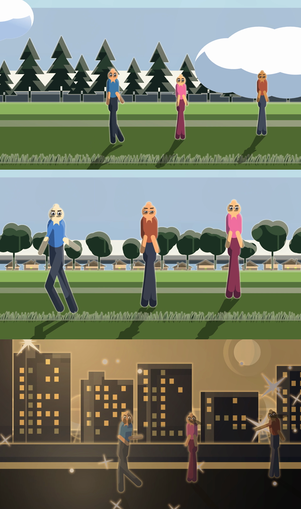

# Three Roads — build report

A fifteen-second film, three shots, three characters, built end to end by one
script with no window open. This is what was made, what broke, what it cost,
and what the tooling actually saved.



---

## 1. What came out

| | |
|---|---|
| **Film** | `three-roads.mp4` — 1920×1080, 24 fps, 360 frames, **15.000 s**, H.264 + AAC |
| **Document** | `three-roads.buzz` — 3 scenes, 59 layers, 11 library symbols, 3 sound tracks |
| **Source** | `three-roads.js` — 424 lines of JSFL-style script; the only input besides the audio |
| **Cast** | Arun and Kabir (male), Meera (female) — bone-rigged bodies, layer-parented faces |

```
buzzanimate --script films/three-roads/three-roads.js \
            --audio "baithak_Marker 01.mp3" --from 30 --for 5 \
            --audio "baithak_Marker 01.mp3" --from 35 --for 5 \
            --audio "baithak_Marker 01.mp3" --from 40 --for 5 \
            --save films/three-roads/three-roads.buzz \
            --render films/three-roads/three-roads.mp4 --height 1080
```

**0.6 s** to build the document. **17.8 s** to render the film. Nobody clicks
anything.

### The three shots

1. **Forest, first light** — daylight, pine treeline, drifting cloud. Arun walks
   in from the left; Kabir turns to look; Meera reacts and speaks.
2. **Village, noon** — written as five lines of prose and handed to the
   director, which staged, cast, blocked and framed it. Houses, trees, a verge.
3. **City, night** — lit skyline, street lamps, stars, a practical on the
   pavement. Arun stands up and runs; Kabir sits and points; Meera talks and
   reaches. The moon is recalled from the asset library, where shot 1 filed it.

### Everything asked for, and where it is

| Asked for | Where |
|---|---|
| Three characters, two male one female | `CAST` in the script; palette, height and head ratio tell them apart |
| Rigged head and eyes | `buzz_act::puppet` — eyes, brows and mouth as library symbols on a parented face layer |
| Lip sync | `document.lipSync`, one call per speaker per shot, against a slice of the take |
| Hand movement | `point`, `reach`, `react` performances |
| Blink | `Modifier::Blink` on the eyes, jittered, one in six a double |
| Three scenes: forest, village, city | Shots 1–3; **Village** is a new scenery kind |
| Two day, one night with lamps | Daylight, Daylight, Night + a practical lamp and street lamps |
| Every pose, rigged to walk | All ten performer actions are on screen: walk, run, idle, talk, sit, stand, turn, point, reach, react |
| The director for staging and pose changes | Shot 2 is `document.directScene(prose)` — nothing in it is placed by hand |
| Camera pan and zoom | Eased keys in shots 1 and 3; a named `drift` move in shot 2 |
| Symbols to the library, and recalled | Eyes / Brows / Mouth shared across each shot's cast; the Moon filed as an **asset** in shot 1 and fetched in shot 3 |
| Save the file, render a video | `--save` and `--render`, in one run |
| Multi-scene | Three scenes in one document, one continuous reel |
| Moving sky, texture, masking, alpha | `movingSky()` — two textured sheets at different alphas and speeds, clipped by a mask layer |
| Bone rig **and** layer-parenting rig | Both, on every character: bones for the limbs, parenting for the face |
| Run it through a script | The whole film is one script |

---

## 2. What had to be built first

The program could stage a shot, cast it, block it and render it. It could not be
handed a brief and left alone to make a *film*, and nothing it cast had a face.

| Built | Why it was missing |
|---|---|
| `buzz_act::puppet` | A staged character was thirteen bones and no face: nothing could blink, nothing could be lip-synced without hand-drawing a mouth and parenting it, once per character per shot |
| `buzz_script::run_film` | A script was handed one `Scene`. It could build the first shot and had no way to reach the second |
| `buzz_script::film` (37 new calls) | Scenes, staging, scenery, casting, rigging, masks, textures, dialogue, lip sync, the asset library, eased camera moves — all reachable only by clicking |
| `--script`, `--save`, `--audio/--from/--for` | `--script` needed a window, so the most capable half of the automation could not run unattended. A dialogue take is minutes long and a shot is seconds long, so the slice matters |
| Bone-level layer parenting | A face could follow a body but not a *head* |
| `Scenery::Village`, `EffectKind::Houses` | There was no village, and `Buildings` shrunk is a row of sheds |
| `Palette::nth` | A staged cast of three was three copies of one man in a blue shirt |
| `directScene` | The director knew who spoke and over which frames, and threw both away |

Two design lines were kept deliberately: **a script still cannot open a file**
(the host opens it and hands over what came out), and the asset library is the
single sanctioned place it may write, exactly as `fl.runScript` is confined to
the Configuration folder.

---

## 3. What was broken, and what it cost to fix

All three were **pre-existing** and shipped in every automatically directed film.
None was found by reading code; each was found by looking at a rendered frame.

### 3.1 A light's rim was drawn without the camera — ~50 min

**Symptom.** Every lit figure and every tree came back with a hollow white copy
of itself beside it.

**Cause.** Filter strokes are drawn by handing the rasteriser the geometry and,
separately, a transform that shapes the *pen* — that is what lets a blur's round
pen become an ellipse without distorting the outline. `draw_ops` cancelled that
transform out of the geometry first, and the stroker cancels it again inside, so
the rim was drawn at the artwork's own coordinates with the camera's transform
divided back out.

**Why it survived.** With no camera and a round pen the transform is the identity
twice over, and nothing showed. The director always frames its shot, so it was
present in every generated film and in none of the tests.

**Cost.** Most of the fifty minutes was bisecting — plain shapes, then clouds,
then the camera, then a *static* off-centre camera, which was the moment it
became obvious. The fix is one argument. Test:
`crates/buzz-app/tests/rim_follows_the_camera.rs`, checked failing (worst channel
difference 186) before the change and passing after.

### 3.2 Guide layers were exported — ~15 min

**Symptom.** A moon drawn in the forest shot, filed as an asset, and hidden on a
guide layer, turned up in the daylit forest anyway.

**Cause.** `LayerKind::paints_to_output` has said since it was written that a
guide does not reach the film, with its own unit tests. Nothing read it: the
render walk asked `paints_on_stage`, which is the *authoring* question, and a
guide answers yes to that because being visible while you draw is the point of
one.

**Why it survived.** Guides draw at 35%, so it read as a bit of dim background
rather than as a mistake. What it actually means is that a photograph put on a
guide layer to trace over is *delivered*, faintly, over the drawing made from it.

**Cost.** Fifteen minutes, most of it confirming the render path really never
asked. Test: `crates/buzz-app/tests/guides_stay_off_the_film.rs`.

### 3.3 Scenery lasted one frame — ~10 min

**Symptom.** A test render came back with a forest in frame 0 and a bare field
for the rest of the shot.

**Cause.** `scenery::lay` makes its layers with `add_stage_layer`, which makes
them one frame long, and it runs *after* the pass in `staging::build` that
stretches a staged scene to length.

**Why it survived.** Every path that had ever called it happened to set the scene
length afterwards. Nothing that renders a still could see it.

**Cost.** Ten minutes. Fixed in `scenery::lay` and `lay_weather` both.

### Smaller things found the same way

| | Fix |
|---|---|
| `Blink` and `Sway` measured a symbol instance as a 2×2 placeholder, so a puppet's eyes closed about their middle instead of their lower lid — and a puppet's eyes are *always* an instance | Resolve bounds through the library |
| A face followed the body, so it slid off the head during a run | `Layer::follows_bone` |
| The village was laid twice — the director now reads *village* out of the prose itself | Stopped asking for it twice |
| The recalled moon was drawn twice: once by the merge, once by a second instance | `placeAsset` returns the layers it merged |
| A texture *replaces* a shape's fill, so `#RRGGBBAA` on the rectangle stopped meaning anything and the sky came out as fog | Put the alpha in the texture's colours |
| The tiled sky texture repeated eleven times across the frame | A tile wider than the stage, at the coarsest detail |
| `stroke_transformed`'s contract was being violated in the only place that used it non-trivially | Documented at the call site |

---

## 4. Where the time went, and what the tools saved

**Total session: about six hours**, of which roughly

- 1h 10m reading the codebase before touching it,
- 2h 30m building what was missing (puppet, film API, headless reach, village, houses, bone parenting),
- 1h 15m on the three defects above,
- 45m writing and re-cutting the film itself,
- 20m tests and this report.

### The loop that made it possible

The single most valuable thing was that **`--script … --save … --render` runs in
18 seconds with no window.** Every one of the ~20 iterations on the film was:
edit the script → run → pull a frame with ffmpeg → look at it. That is a
half-minute cycle. The same loop through the editor is: launch, open, wait,
click through five dialogs per character, scrub, export, look — and it cannot be
repeated identically, which is what made the bisection in §3.1 possible at all.

### What each tool actually removed

| Tool | What it replaced | Rough saving on *this* film |
|---|---|---|
| `--script`/`--save`/`--render` | Opening the app and driving it by hand, once per iteration | ~20 iterations × ~10 min ≈ **3 h** |
| `puppet::build` | Drawing eyes, brows and a mouth; making three symbols; placing them on each of 9 characters; parenting each face; adding blink and breathe | 9 characters × ~15 min ≈ **2 h** |
| `directScene` (shot 2) | Placing three actors, timing ten beats against each other, and keying the camera on the speaker | ~**40 min**, and it is 5 lines of prose |
| `lipSync` | Choosing a mouth shape per frame — 62 keyframes here — for three speakers | 3 × ~30 min ≈ **1 h 30 m** |
| Effect brushes + `layScenery` | Drawing a treeline, a village and a skyline, stroke by stroke, three times | ~**2 h** |
| `Modifier::Blink` / `Breathe` / `Drift` | Keying a blink every few seconds and a breath on every hold, on 9 characters, plus a scrolling sky | **hours**, and it costs *zero keyframes* — re-time the film and it all still works |
| Asset library | Redrawing the moon in shot 3 | minutes here; the point is that it survives the document |
| Named eased camera moves | Hand-keying and hand-easing every push and pan | ~**20 min** |

Rough total: **a day and a half of hand work compressed into an 18-second
command**, plus the six hours of engineering that made the command exist.

The honest caveat: the six hours are not repeatable savings — they were spent
once, on machinery that now exists. What repeats is the 18 seconds, and the fact
that the second film costs the writing and nothing else.

### The other saving, which is harder to count

The three defects had all shipped. They were found because **one script rendered
the whole system at once** — camera *and* lights *and* scenery *and* a guide
layer *and* three scenes — which no unit test did and no hand-driven session
would have, because a person driving the app by hand does not do all of that in
one sitting and then look at frame 20 of shot 1 at pixel accuracy. Making the
film was the test.

---

## 5. What is still not right

Named rather than hidden:

- **The sky reads hazier than a clear morning should.** The drifting sheets veil
  it more than their alpha suggests; the lit image fill is brighter than the
  arithmetic predicts and that has not been chased down.
- **A figure's arms hang inside its own silhouette.** It is the stock figure and
  it reads as a puppet rather than a drawing.
- **The night shot is very warm.** Two practicals, and it lands closer to sodium
  street lighting than to night.
- **The face does not turn.** `rotation_y` is still never set by anything
  automatic (`AUTOMATION.md` §2.6), so a character walking left is a mirror
  rather than a turnaround.
- **The director's own camera keys still carry no ease** (§2.5). The three named
  moves and the hand-written keys in shots 1 and 3 are eased; the ones the
  director writes in shot 2 are not.

---

## 6. Second pass — what the film's own workflow was missing

Six things asked for after the first cut, and one bug found while doing them.

### 6.1 The bone rig came off the character — ~35 min

**Symptom.** Drag a bone on a rigged figure and the artwork jumps away from the
skeleton.

**Cause.** Dragging from a bone's *tip* extends the chain, and extending called
`Armature::set_rest_here` — which adopts the pose the bones are in **now** as
the pose they were drawn in. On a rig being built that is right and invisible.
On a finished, posed rig it is a catastrophe: every rigidly bound part is drawn
through `pose_transform`, which measures a bone against its rest, so re-resting
a posed skeleton makes all of those the identity. The drawing snaps back to
where it was drawn while the bones stay where the animator put them.

**Why it was so easy to hit.** *The end of a bone is what you reach for to move
a limb* — the end of a forearm is the hand. The tip is exactly what extended the
chain.

**Fixed** in three parts, because it was three problems wearing one coat:

- `add_bone` leaves the rest pose alone. A bone from `push_dragged` already
  rests at the angle it was dragged at, so nothing needed re-resting.
- **Dragging a bone poses it** unless the Bone tool is set to Builds. Building a
  skeleton and animating one are opposite jobs that want the same gesture.
- **Show bones** takes the skeleton off the stage *and* out of the pointer's
  way, so the artwork underneath can be worked on.

Two regression tests, both checked failing before the fix — the artwork jumped
29 units.

### 6.2 The scrub hummed — ~20 min

Dragging the playhead repositioned the audio on **every pointer move**: sixty
times a second over a timeline running at twenty-four, so the same few
milliseconds restarted over and over. A run of restarts at a steady rate is not
a series of clicks, it is a *tone* — which is the hum that sat under the audio.

Two halves, and both were needed. The mixer now travels between silence and full
over five milliseconds and **defers a seek until the gain has reached zero**, so
nothing it does arrives as a step; and the editor only repositions when the
frame has actually changed.

### 6.3 The rest, as asked

| Asked for | What it is |
|---|---|
| **See the render before writing it** | `Test render` in the Export dialog draws six frames from across the range through the export's own pipeline. `--preview sheet.png` writes the same six as a contact sheet — 2.6 s for this film. |
| **Panels for the director, scenery and scene setup** | The **Story** panel. *Direct a Story* and *Set the Scene* were modal dialogs, which is the wrong shape for something written and rewritten: a box covering the stage while you type is a box you cannot see the result through. |
| **Your own trees, grass and ground** | Every part of a set — trees, grass, buildings, lamps — takes a library symbol instead of the effect brush, scattered along the same line at the same size with the same jitter. |
| **See the words the director used** | `Scene::brief` keeps the prose a shot was directed from, saved with the document and shown in the Story panel, where it can be edited and re-directed. It used to be thrown away the moment the shot appeared. |
| **Show and hide the bone rig** | Tool Options, with the Bone tool in hand. Hidden means hidden from the pointer too. |
| **How to move a limb** | User guide §12, rewritten. It had promised "grab the hand and drag" for a behaviour that did the opposite. |

### 6.4 What this round cost

About **three hours**, of which roughly 55 minutes on the two bugs, 80 on the
Story panel and the custom scenery, 35 on the test render, and the rest on tests
and documentation.

The pattern from §4 held: both bugs were found by *using* the thing, not by
reading it. The hum was found by scrubbing the film's own soundtrack; the rig
came apart the first time somebody grabbed a hand.

---

## 7. Verification

- `cargo test --workspace` — **2540 passed, 0 failed**.
- Every regression test here was checked *failing* before its fix and passing
  after; each reports the number it actually measured.
- The saved `.buzz` was re-opened and re-rendered on its own — 360 frames,
  15.000 s, three sounds — so the document is complete rather than a by-product
  of the run that made it.
